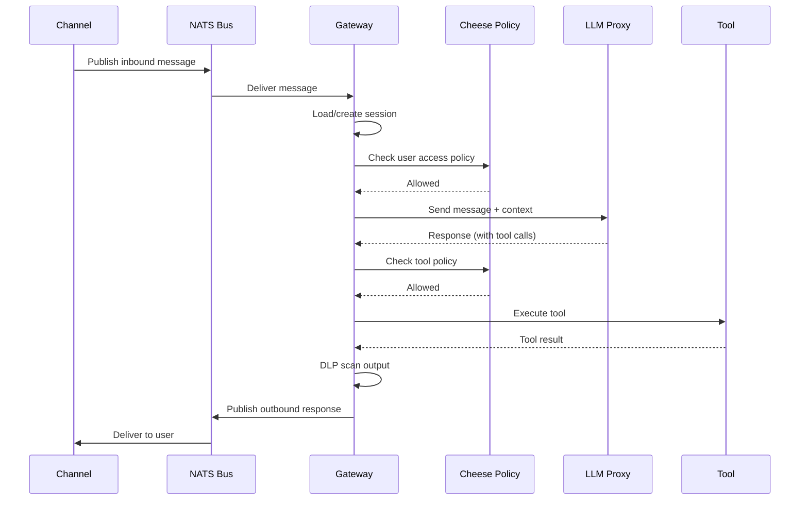

# Gateway

The gateway is the control plane of Nachos. Every message and tool call flows through it. It enforces security policies, manages sessions, routes requests between channels, the LLM, and tools, and logs all security-relevant actions.

## Responsibilities

- **Policy enforcement** -- evaluates every action against Cheese policy rules before allowing it
- **Session management** -- tracks conversation state per user and channel
- **Tool routing** -- dispatches tool calls to containers (via NATS) or local handlers (in-process)
- **DLP scanning** -- checks both inbound and outbound content for sensitive data
- **Audit logging** -- emits structured audit events for all security decisions
- **Skill loading** -- parses SKILL.md files and injects CLI tool documentation into LLM prompts
- **Scheduler** -- manages cron jobs and heartbeat system for time-based automation
- **Subagent orchestration** -- queues, executes, and announces background AI tasks
- **Native tools** -- runs GitHub, Bitbucket, web search/fetch, browser, memory, and agent exec directly in-process

## Request flow



## Tool execution architecture

The gateway uses a layered tool execution pipeline:

1. **ToolExecutor** -- receives tool calls from the LLM, normalizes names, runs DLP on inputs
2. **ToolCoordinator** -- resolves security tier, checks Cheese policy, handles approval flow, manages caching
3. **Routing** -- local tools go to `LocalToolHandler`, container tools go via NATS request/reply
4. **DLP scan** -- output is scanned before returning to the LLM

Tools fall into two categories:

| Category | Runs in | Communication | Examples |
|----------|---------|---------------|---------|
| **Container-based** | Isolated Docker container | NATS request/reply | Filesystem, Code Runner |
| **Gateway-local** | Gateway process | Direct function call | Shell, Browser, Memory, Web Fetch, GitHub, Cron |

Gateway-local tools execute faster (no container overhead) and use fewer resources.

## Session storage

Sessions are stored in SQLite or PostgreSQL via the state layer:

```toml
[runtime.state.sessions]
provider = "sqlite"   # or "postgres"
```

Redis is used for caching, rate limiting, and distributed state when available.

## Scheduler

The scheduler runs cron jobs and the heartbeat system:

- Checks for due jobs every `check_interval_ms` (default: 60 seconds)
- Executes `systemEvent` actions by injecting text into sessions
- Spawns `agentTurn` actions as isolated runs
- Persists jobs to the state database
- Supports `at` (one-shot), `every` (interval), and `cron` (expression) schedules

## Skill hot reload

Skills are watched for changes and automatically reloaded:

- Gateway watches `skills/*/SKILL.md` files
- When a skill file changes, it is reparsed and injected on the next LLM call
- No restart required for skill updates

## Network

The gateway joins both `nachos-internal` (to communicate with bus, tools, Redis) and `nachos-egress` (to reach external LLM APIs and channel APIs).

## Key source files

| File | Purpose |
|------|---------|
| `core/gateway/src/router.ts` | Message routing logic |
| `core/gateway/src/tools/tool-executor.ts` | Tool definition building, DLP scanning, dispatch |
| `core/gateway/src/tools/coordinator.ts` | Policy check, parallel/sequential execution |
| `core/gateway/src/tools/local-tool-handler.ts` | Routes to ShellTool or BrowserLocalTool |
| `core/gateway/src/cheese/policy/evaluator.ts` | Policy evaluation engine |
| `core/gateway/src/tools/shell-tool.ts` | CLI binary execution with allowlisting |
| `core/gateway/src/skills/skill-loader.ts` | SKILL.md parsing and hot reload |
| `core/gateway/src/subagents/subagent-orchestrator.ts` | Subagent queuing and execution |
