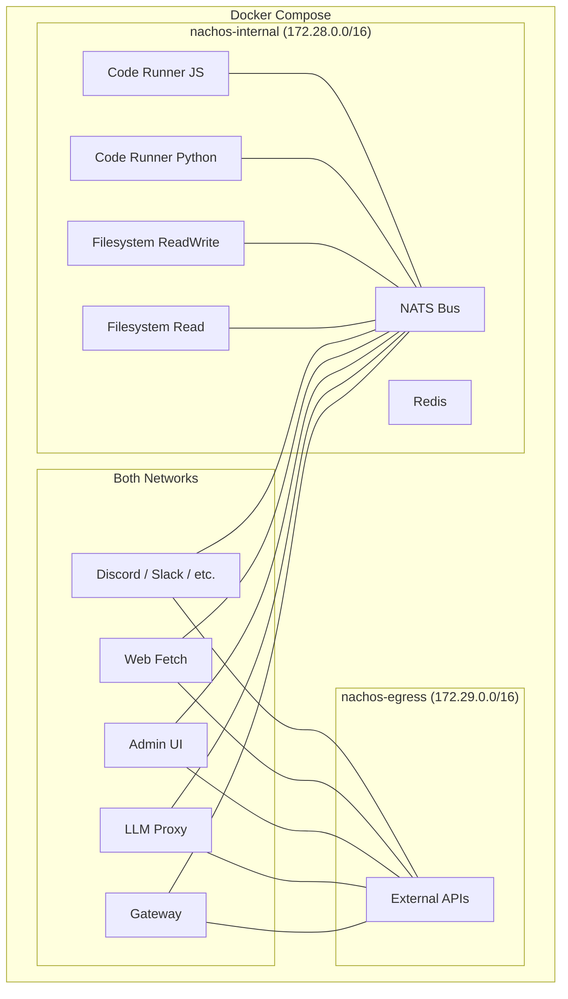

# Architecture

Nachos is a **Docker-native, security-first, modular AI assistant framework**. Every component -- channels, tools, security policies, state stores -- runs as an isolated Docker container. Users compose their desired configuration through a single `nachos.toml` file, and the CLI generates the appropriate `docker-compose.yml` to bring the stack up.

## System diagram

## Core services

| Service | Role | Always running |
|---------|------|----------------|
| **Gateway** | Policy enforcement, session management, tool routing, DLP scanning, audit logging | Yes |
| **Bus** | NATS message broker for all inter-service communication | Yes |
| **LLM Proxy** | Provider abstraction with failover and multi-profile auth | Yes |
| **Redis** | Session state, rate limiting, caching | Yes |
| **Admin** | Web dashboard for monitoring and management (port 8082) | Optional |

## Key design principles

**Composability over monoliths.** Each concern (message routing, LLM communication, tool execution, policy enforcement) is a separate container with a well-defined interface. Users add or remove channels and tools without touching core infrastructure.

**Security by default.** The embedded Cheese policy engine enforces deny-by-default access control with sub-millisecond evaluation. Containers run as non-root with read-only filesystems, dropped capabilities, and network isolation.

**Two-network isolation.** Nachos creates two Docker networks:

- **`nachos-internal`** -- `internal: true`, no external access. Used for inter-container communication (NATS, Redis, tool containers).
- **`nachos-egress`** -- Standard bridge with internet access. Used by containers that must reach external APIs (LLM providers, channel APIs, web fetch).

Containers only join the networks they need.

## Message flow

1. A user sends a message through a **channel** (Slack, Discord, Telegram, WhatsApp, Matrix)
2. The channel container normalizes the message and publishes it to the **bus**
3. The **gateway** receives it, checks **policies** (Cheese engine), and manages the **session**
4. The gateway forwards the message to the **LLM proxy**
5. The LLM proxy calls the configured **LLM provider** and returns the response
6. If the LLM requests a **tool call**, the gateway evaluates the policy and security tier, then routes the call to the appropriate handler (container-based via NATS, or gateway-local)
7. Both tool inputs and outputs pass through **DLP scanning**
8. The final response flows back through the bus to the channel
9. Every security-relevant action is written to the **audit log**

## Container security defaults

All containers run with hardened settings:

| Setting | Value | Purpose |
|---------|-------|---------|
| `user` | `1001:1001` | Non-root execution |
| `read_only` | `true` | Read-only root filesystem |
| `security_opt` | `no-new-privileges:true` | Prevents privilege escalation |
| `tmpfs` | `/tmp:noexec,nosuid,size=10m` | Secure temporary storage |

Resource limits per container:

| Container | Memory | CPU | PIDs |
|-----------|--------|-----|------|
| Gateway | 2 GB | 2.0 | 200 |
| LLM Proxy | 1 GB | 1.0 | 100 |
| Admin | 512 MB | 1.0 | 100 |
| Code Runners | 512 MB | 1.0 | 100 |

## Deep dives

- [Gateway](/architecture/gateway) -- the control plane
- [Bus](/architecture/bus) -- NATS message routing and topic structure
- [LLM Proxy](/architecture/llm-proxy) -- provider abstraction and failover
- [Subagent Orchestration](/architecture/subagents) -- background tasks and workflows
