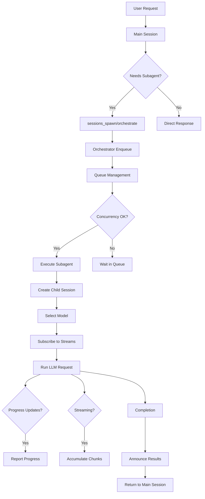

# Subagent Orchestration

Nachos implements a sophisticated subagent system for running complex tasks in isolated background sessions while maintaining conversational flow in the main session.

## Overview

**Subagents** are isolated AI sessions that execute independently from the main conversation. They enable:
- **Async execution** - Main conversation continues while subagents work
- **Parallel tasks** - Run multiple analyses simultaneously
- **Complex workflows** - Multi-step processes with dependencies
- **Resource isolation** - Separate workspaces and execution contexts

## Architecture

### Components

<Steps>
  <Step title="SubagentManager">
    Executes individual subagent tasks with configurable isolation (host mode or Docker sandbox).
  </Step>
  
  <Step title="SubagentOrchestrator">
    Manages queuing, concurrency, session lifecycle, and result announcement.
  </Step>
  
  <Step title="WorkflowEngine">
    Validates DAGs, computes execution plans via topological sort, and coordinates multi-step workflows.
  </Step>
  
  <Step title="Model Selection">
    Routes tasks to appropriate AI models based on complexity, hints, or explicit selection.
  </Step>
</Steps>

### Execution Flow



## Key Features

### Model Selection

**New in v2.0** - Automatic or explicit model routing optimizes cost vs capability.

#### Selection Priority

1. **Explicit model parameter** → Resolve alias → Use that model
2. **Model hint** (fast/balanced/thorough) → Map to model
3. **Auto-selection** enabled? → Analyze task complexity
4. **Default model** from config
5. **Fallback** to Sonnet

#### Auto-Selection Heuristics

Tasks are analyzed for complexity indicators:

**→ Opus (thorough):**
- Keywords: *analyze, review, audit, investigate, comprehensive*
- Code keywords: *codebase, vulnerabilities, refactor, bugs*
- Multi-step indicators: numbered lists, "then", "after"
- Long tasks (>40 words)

**→ Haiku (fast):**
- Short tasks (<8 words)
- No complexity keywords

**→ Sonnet (balanced):**
- Default for medium complexity

**Example configuration:**
```toml
[gateway.subagent.models]
haiku = "anthropic.claude-haiku-4-5-20251001-v1:0"
sonnet = "anthropic.claude-sonnet-4-6"
opus = "anthropic.claude-opus-4-6-v1"
auto_select = true
default_model = "sonnet"
```

### Progress Reporting

**New in v2.0** - Real-time status updates from long-running tasks.

Subagents call `subagent_progress` tool:

```typescript
await subagent_progress({
  status: "Analyzing file 23 of 50",
  percentage: 46,
  metadata: { filesProcessed: 23, totalFiles: 50 }
});
```

**Storage:**
- Progress updates stored in `SubagentRunRecord.progress[]`
- Throttled to 1 second minimum interval
- Accessible via `subagents info` action

**Benefits:**
- Users know subagent is active
- Early detection of issues
- Progress bars and ETAs possible

### Streaming Results

**New in v2.0** - Deliver partial results before completion.

When `stream: true`:
1. Subscribe to NATS topic `nachos.llm.stream.{childSessionId}`
2. LLM chunks published to topic in real-time
3. Chunks accumulated in `SubagentRunRecord.streamChunks[]`
4. Optional real-time delivery to requester (throttled)

**Configuration:**
```toml
[gateway.subagent.streaming]
enabled = true
deliver_to_requester = true
chunk_throttle_ms = 500  # Min time between deliveries
```

**Use cases:**
- Long reports (50+ pages)
- Documentation generation
- User wants to see progress

### Workflow Orchestration

**New in v2.0** - Multi-step workflows with dependency management.

#### DAG Validation

Before execution, workflows are validated:
- No duplicate step IDs
- All dependencies reference existing steps
- No circular dependencies (DFS cycle detection)
- Within configured limits (max steps, max depth)

**Example validation error:**
```json
{
  "error": {
    "code": "CYCLE_DETECTED",
    "message": "Workflow contains circular dependency: a → b → a"
  }
}
```

#### Execution Planning

Uses **Kahn's algorithm** for topological sort:

1. Build adjacency list and in-degree map
2. Queue all nodes with in-degree 0
3. Process nodes in batches (parallel execution within batch)
4. For each processed node, decrement dependent nodes' in-degree
5. When dependent reaches 0, add to next batch

**Example:**
```typescript
// Workflow definition
{
  steps: [
    { id: 'fetch', task: '...' },
    { id: 'validate', task: '...', dependsOn: ['fetch'] },
    { id: 'enrich', task: '...', dependsOn: ['fetch'] },
    { id: 'merge', task: '...', dependsOn: ['validate', 'enrich'] }
  ]
}

// Execution plan
{
  batches: [
    ['fetch'],                // Batch 1: No dependencies
    ['validate', 'enrich'],   // Batch 2: Parallel (both wait for fetch)
    ['merge']                 // Batch 3: Waits for both
  ]
}
```

#### Result Passing

Results from completed steps are automatically injected:

```
Step 2 prompt = Step 2 task + "\n\n**Results from dependencies:**\n" + results
```

This enables data flow through the workflow without manual coordination.

## Session Metadata

Child sessions include metadata for context and access control:

```typescript
{
  subagent: {
    runId: "run-abc123",
    label: "security-audit",
    requester: {
      sessionId: "main-session-id",
      channel: "discord",
      conversationId: "conv-id",
      userId: "user-id"
    },
    workspaceDir: "/workspace/run-abc123",
    workflowId: "workflow-xyz789",  // If part of workflow
    stepId: "analyze"                // If part of workflow
  }
}
```

**Access control:**
Users can only access subagents/workflows where:
- They're the requester session, OR
- They're the same user ID

## Configuration

### Basic Setup

```toml
[gateway.subagent]
mode = "host"                    # or "full" for Docker sandbox
max_concurrent = 2               # Parallel execution limit
default_timeout_seconds = 300    # 5 minutes default

[gateway.subagent.announce]
enabled = true
# Optional custom prompt template
```

### Model Configuration

```toml
[gateway.subagent.models]
# Model aliases
haiku = "anthropic.claude-haiku-4-5-20251001-v1:0"
sonnet = "anthropic.claude-sonnet-4-6"
opus = "anthropic.claude-opus-4-6-v1"

# Enable auto-selection
auto_select = true

# Default when no model specified
default_model = "sonnet"
```

### Streaming Configuration

```toml
[gateway.subagent.streaming]
enabled = true
deliver_to_requester = true
chunk_throttle_ms = 500
```

### Workflow Configuration

```toml
[gateway.subagent.workflows]
max_steps = 50     # Maximum steps per workflow
max_depth = 5      # Maximum nested workflow depth
```

### Docker Sandbox (Optional)

```toml
[gateway.subagent.docker]
image = "nachos/subagent-sandbox:latest"
network = "none"
memory_limit = "512m"
cpu_shares = 512
timeout_ms = 300000
```

## Security

### Isolation

- **Workspace**: Each run gets unique directory with path traversal protection
- **Session**: Separate conversation state (no cross-contamination)
- **Docker**: Full container isolation (optional)

### Path Traversal Protection

```typescript
const normalized = path.normalize(relativePath);
if (normalized.startsWith('..') || path.isAbsolute(normalized)) {
  throw new Error('Path traversal detected');
}
```

### Access Control

Enforced at every operation:

```typescript
if (session.id !== run.requester.sessionId && 
    session.userId !== run.requester.userId) {
  return { error: 'NOT_FOUND' };
}
```

## Performance

### Resource Usage

**Per subagent session:**
- Memory: ~1-2 MB (messages + metadata)
- Workspace: Configurable, default 50 MB limit
- Docker containers: 512 MB default

**Scaling estimates:**
- 10 concurrent subagents: ~20-30 MB
- 100 runs in history: ~100-200 MB

### Concurrency Tuning

Default `maxConcurrent = 2` is conservative. Adjust based on resources:

```toml
[gateway.subagent]
max_concurrent = 8  # Moderate load
# max_concurrent = 16  # High-end servers
```

Higher concurrency requires more CPU and memory.

## Extension Points

### Custom Announcement Templates

Override default result summarization:

```toml
[gateway.subagent.announce]
prompt = """
Summarize subagent results:
- Task: [description]
- Key Findings: [bullets]
- Recommendations: [if applicable]
"""
```

### Event Listeners (Future)

Subscribe to subagent lifecycle events via NATS:

```typescript
// Future API
await nats.subscribe('nachos.subagent.spawned.*');
await nats.subscribe('nachos.subagent.progress.*');
await nats.subscribe('nachos.subagent.completed.*');
```

## Tools

### sessions_spawn

Spawn individual background tasks.

**Parameters:**
- `task` (required) - Task description
- `model` - Model ID or alias
- `modelHint` - fast/balanced/thorough
- `stream` - Enable streaming
- `runTimeoutSeconds` - Execution timeout
- `cleanup` - delete/keep workspace

[Full reference →](/tools/sessions-spawn)

### sessions_orchestrate

Define multi-step workflows.

**Parameters:**
- `steps[]` - Array of workflow steps
  - `id` (required) - Unique step identifier
  - `task` (required) - Step description
  - `dependsOn[]` - Prerequisite step IDs
  - `model` - Model for this step
  - `stream` - Enable streaming for this step
- `label` - Workflow label
- `continueOnFailure` - Continue despite failures

[Full reference →](/tools/sessions-orchestrate)

### subagents

Monitor and manage subagents/workflows.

**Actions:**
- `list` - List all runs
- `info` - Get run details (includes progress, stream chunks)
- `log` - View conversation log
- `stop` - Stop queued run
- `steer` - Send message to running subagent
- `files_list` - List workspace files
- `files_get` - Read workspace file
- `workflow_list` - List workflows
- `workflow_info` - Get workflow status

[Full reference →](/tools/subagents)

### subagent_progress

Report progress from within subagents.

**Parameters:**
- `status` (required) - Human-readable status
- `percentage` - Progress percentage (0-100)
- `metadata` - Structured tracking data

[Full reference →](/tools/subagent-progress)

## Best Practices

### Task Description

<CodeGroup>
```typescript Bad
task: "Research AI"
```

```typescript Good
task: "Research AI developments in 2025, focusing on LLMs and multimodal models. Summarize in 3 paragraphs with sources."
```
</CodeGroup>

### Model Selection Strategy

- **Haiku** for: Syntax checks, simple queries, quick validations
- **Sonnet** for: Code reviews, documentation, medium analysis
- **Opus** for: Security audits, architectural reviews, complex research

### Workflow Design

**Linear for sequential dependencies:**
```typescript
Fetch → Validate → Process → Store
```

**Parallel for independent work:**
```typescript
[Web search, Doc search, Code search] → Synthesis
```

**Diamond for split-merge patterns:**
```typescript
Fetch → [Transform A, Transform B] → Merge
```

## Troubleshooting

<AccordionGroup>
  <Accordion title="Subagent stuck in 'queued'">
    **Cause:** Concurrency limit reached
    
    **Solutions:**
    - Wait for running subagents to complete
    - Stop unnecessary queued runs
    - Increase `max_concurrent` (admin only)
  </Accordion>

  <Accordion title="Workflow validation failed">
    **Common errors:**
    - `CYCLE_DETECTED` - Circular dependencies
    - `MISSING_DEPENDENCY` - Step references non-existent step
    - `DUPLICATE_STEP_ID` - Two steps have same ID
    
    **Solution:** Fix workflow definition based on error message
  </Accordion>

  <Accordion title="Progress not updating">
    **Causes:**
    - Subagent not calling `subagent_progress`
    - Updates throttled (>1 per second)
    - Wrong run ID
    
    **Solution:** Verify run ID and check throttling
  </Accordion>

  <Accordion title="Streaming not working">
    **Causes:**
    - Streaming not enabled in request (`stream: true`)
    - Streaming disabled in config
    - Subagent completed before chunks delivered
    
    **Solution:** Check request params and config
  </Accordion>
</AccordionGroup>

## Next Steps

<CardGroup cols={2}>
  <Card title="Spawn subagents" icon="rocket" href="/tools/sessions-spawn">
    Learn to create background tasks
  </Card>
  <Card title="Build workflows" icon="diagram-project" href="/tools/sessions-orchestrate">
    Orchestrate multi-step processes
  </Card>
  <Card title="Monitor execution" icon="chart-line" href="/tools/subagents">
    Track progress and manage tasks
  </Card>
  <Card title="Gateway architecture" icon="server" href="/architecture/gateway">
    Understand core orchestration layer
  </Card>
</CardGroup>
