# Architecture Diagrams

Internal reference for the Nachos team. All diagrams are interactive — zoom and pan with the controls that appear on hover.

**Jump to:** [System Overview](#system-overview) | [Gateway](#gateway-internals) | [Message Flow](#message-flow) | [Policy Engine](#salsa-policy-engine) | [Context Management](#context-management) | [Tool Execution](#tool-execution) | [Subagents](#subagent-system) | [State Layer](#state-layer) | [Bus](#nats-message-bus) | [LLM Proxy](#llm-proxy) | [Channels](#channels-architecture) | [Skills](#skills-system) | [Audit](#audit-system) | [Containers](#container-architecture) | [Network](#network-topology) | [Config Flow](#configuration-flow) | [Security Gates](#security-gate-sequence) | [Session Lifecycle](#session-lifecycle) | [Package Graph](#monorepo-package-graph) | [CLI Tree](#cli-command-tree)

---

## System Overview

Full stack: users, channels, core layer, LLM layer, tools, skills, and external services.


---

## Gateway Internals

The gateway is the central orchestrator. Every subsystem initializes from `GatewayOptions` at startup.

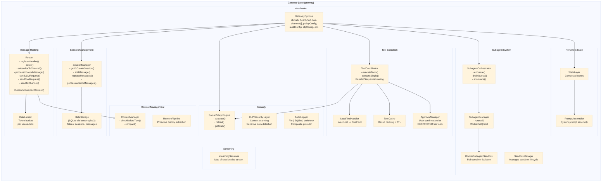

---

## Message Flow

Full sequence: user message through rate limiting, policy, DLP, session, context management, LLM, tool execution, and response delivery.


---

## Salsa Policy Engine

Policy loading, evaluation, condition matching, and decision output.


### Policy Rule Class Diagram

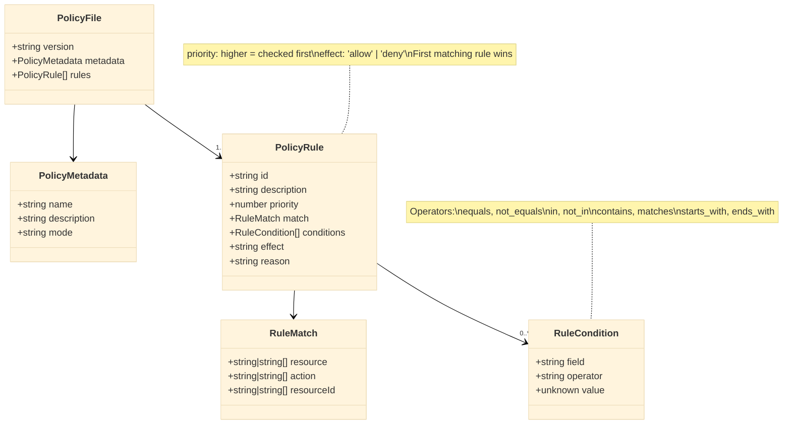

### Security Modes Comparison

```mermaid
%%{init: {'theme': 'base'}}%%

flowchart LR
    subgraph Strict["Strict Mode (default)"]
        S1["All tools disabled"]
        S2["Allowlisted DMs only"]
        S3["Full audit logging"]
        S4["No network egress"]
    end

    subgraph Standard["Standard Mode"]
        ST1["Common tools enabled"]
        ST2["Pairing-based DM access"]
        ST3["Selective audit"]
        ST4["Controlled egress"]
    end

    subgraph Permissive["Permissive Mode"]
        P1["All tools enabled"]
        P2["Full channel access"]
        P3["Minimal audit"]
        P4["Full network access"]
    end

    Strict ---|"Opt-in"| Standard ---|"Explicit opt-in"| Permissive
```

---

## Context Management

Budget zones, sliding window compaction, memory extraction pipeline, and bus events.

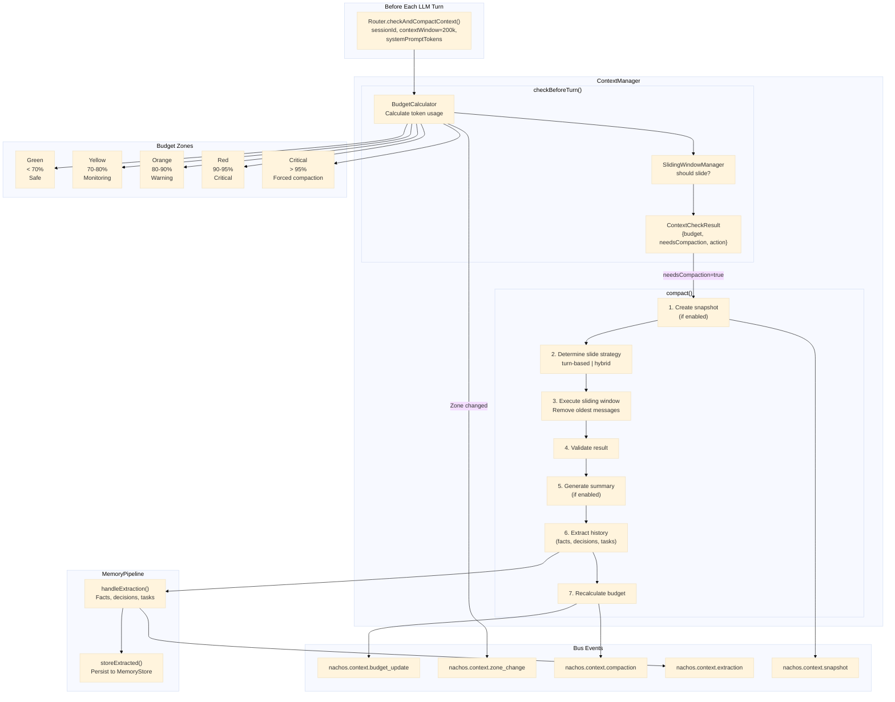

### Sliding Window Configuration

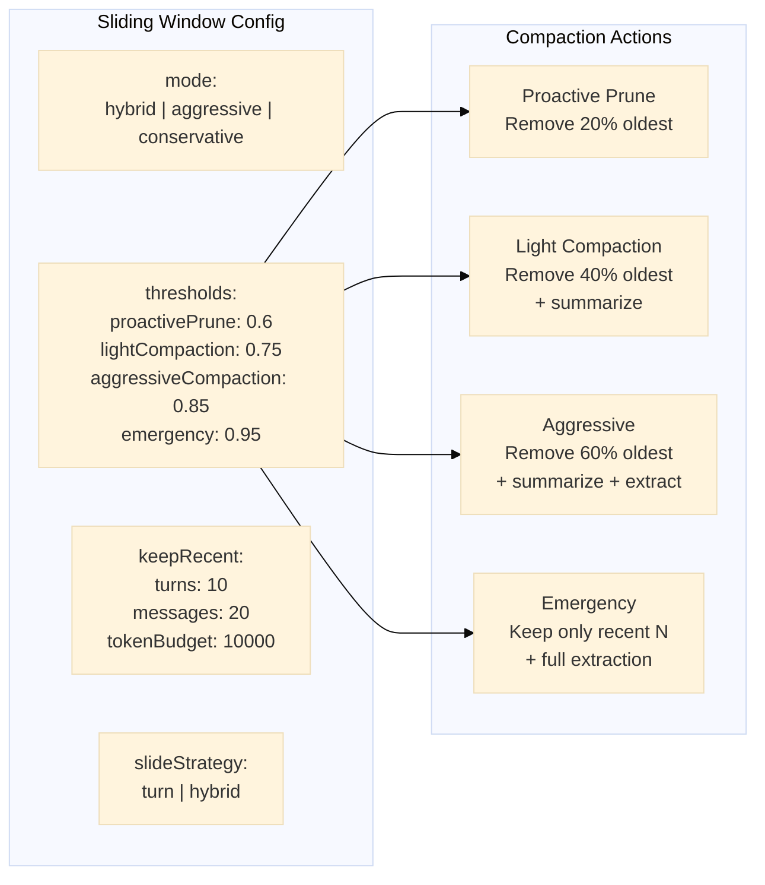

---

## Tool Execution

Security tier resolution, policy checks, approval gates, caching, and local vs. remote routing.

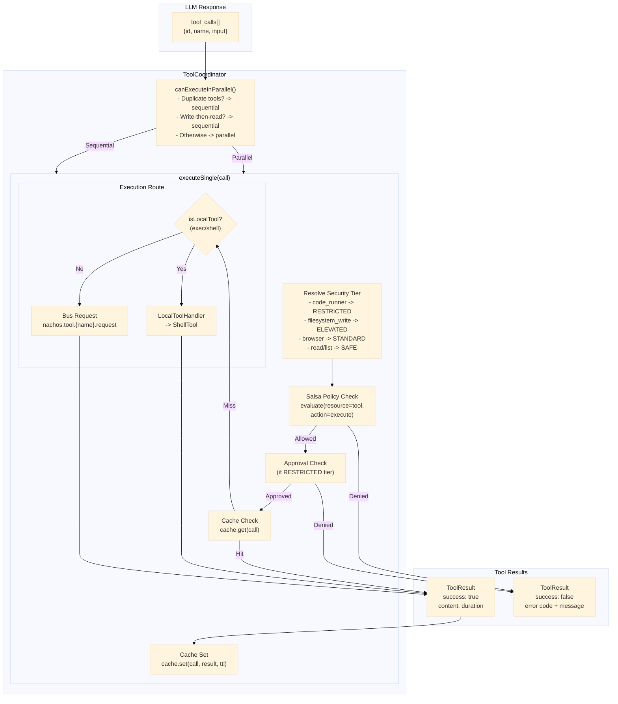

### Security Tiers

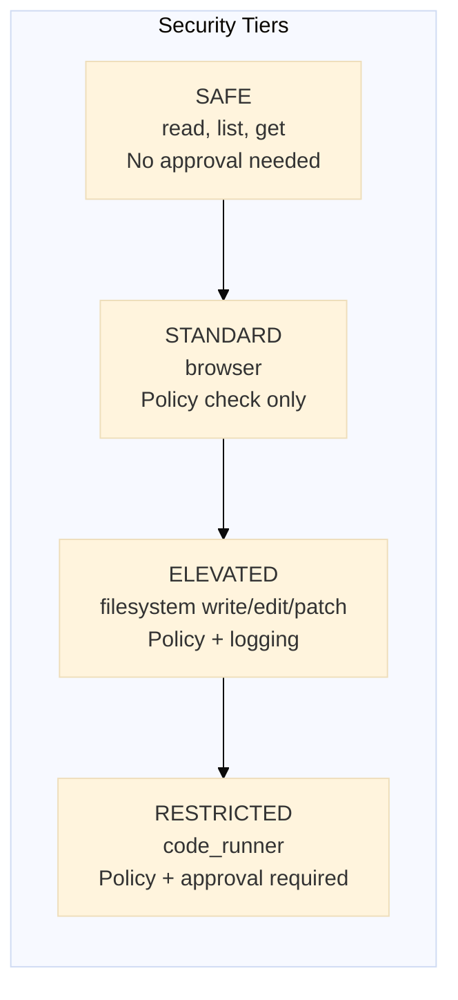

### Shell Tool (Skills Execution)

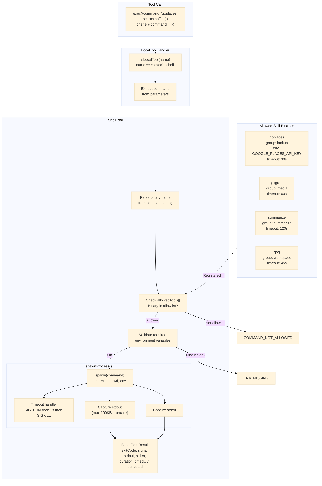

---

## Subagent System

Queue-based orchestration, sandbox modes, and child session management.

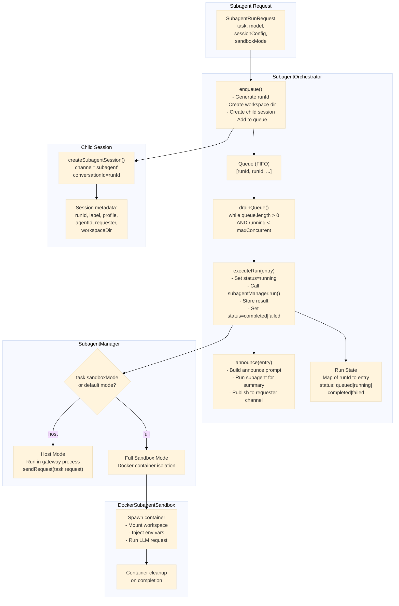

### Subagent Lifecycle

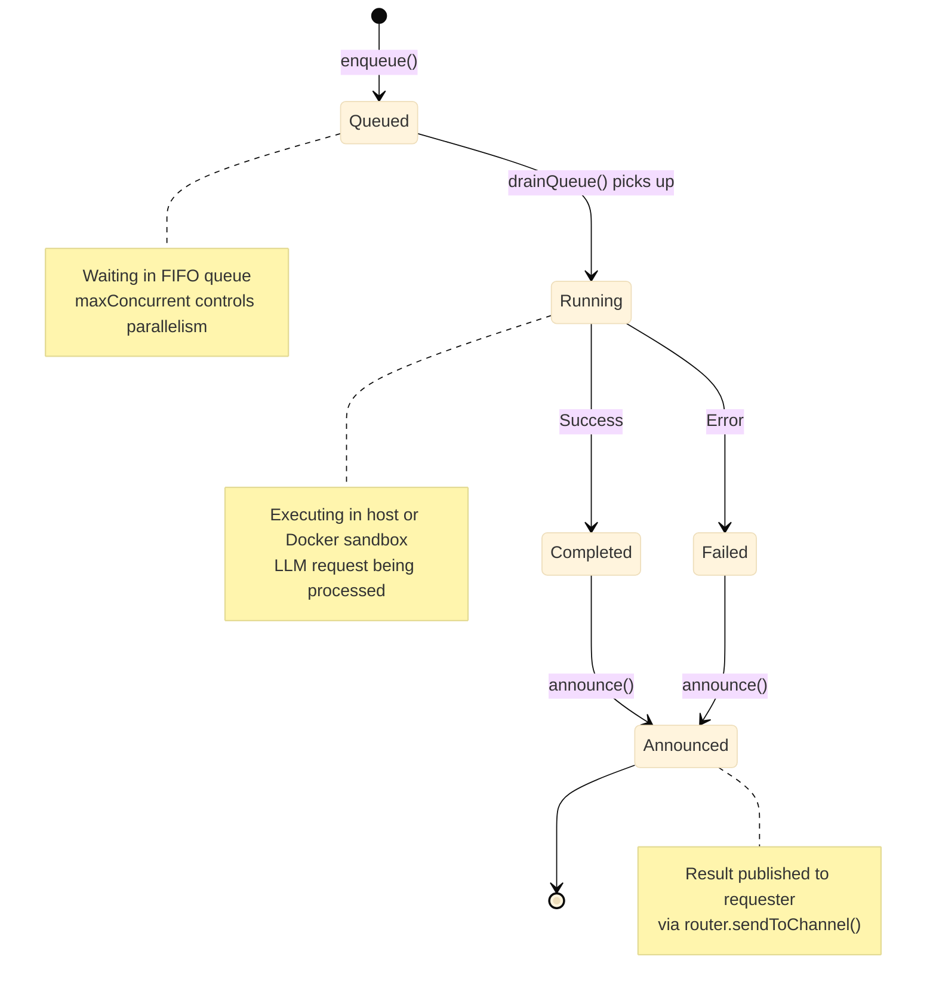

---

## State Layer

Policy-gated, audit-hooked access to identity, memory, user profiles, and session state stores.

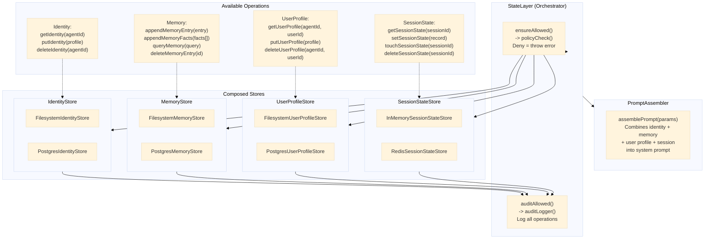

### Session Storage (ER Diagram)

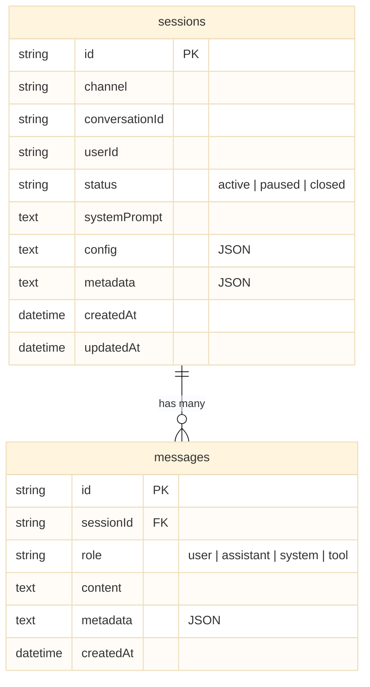

---

## NATS Message Bus

Client API, full topic namespace, and bus implementations.

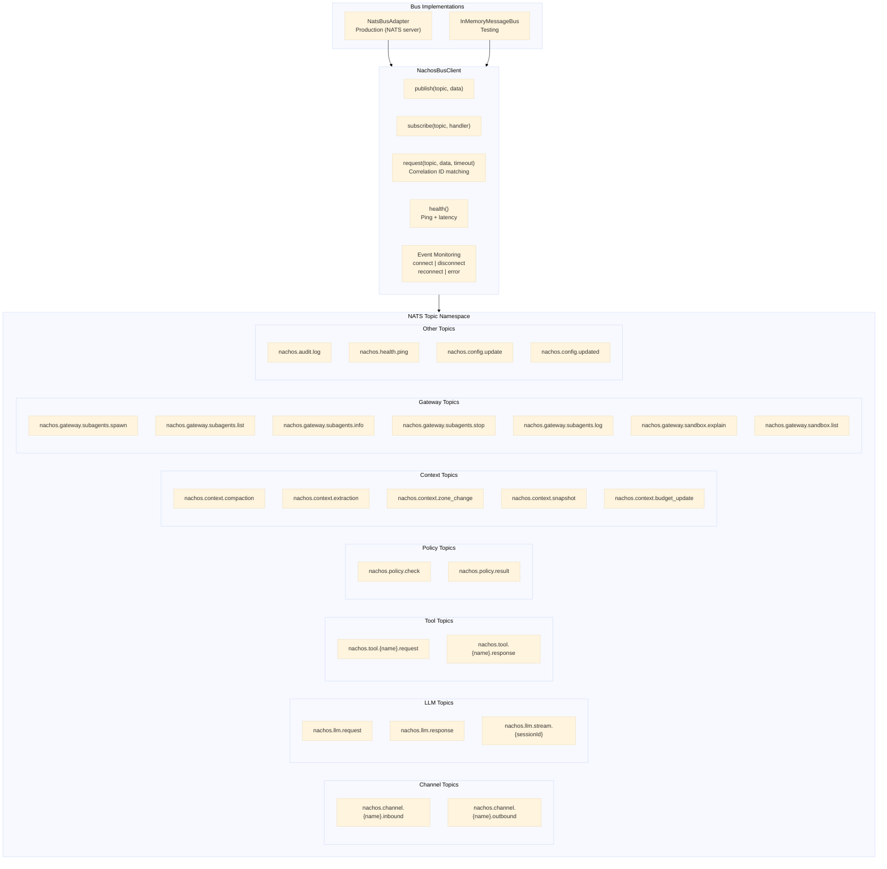

### Message Envelope


---

## LLM Proxy

Provider selection, retry with backoff, cooldown management, failover chain, and streaming.

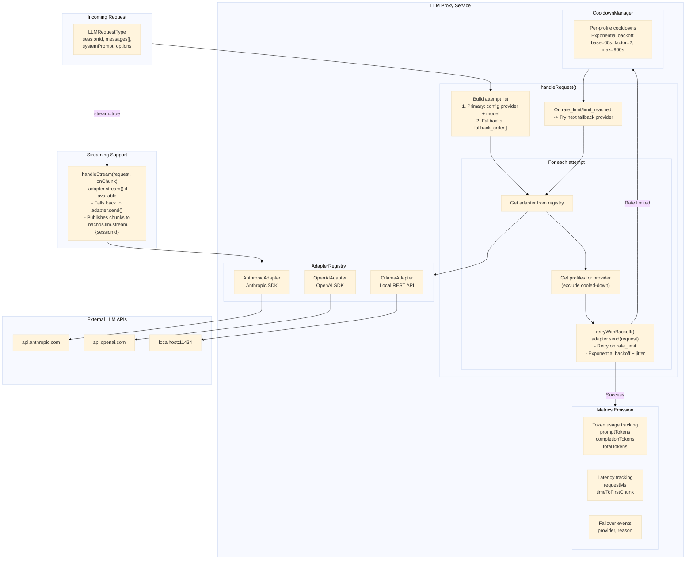

### Provider Failover Sequence

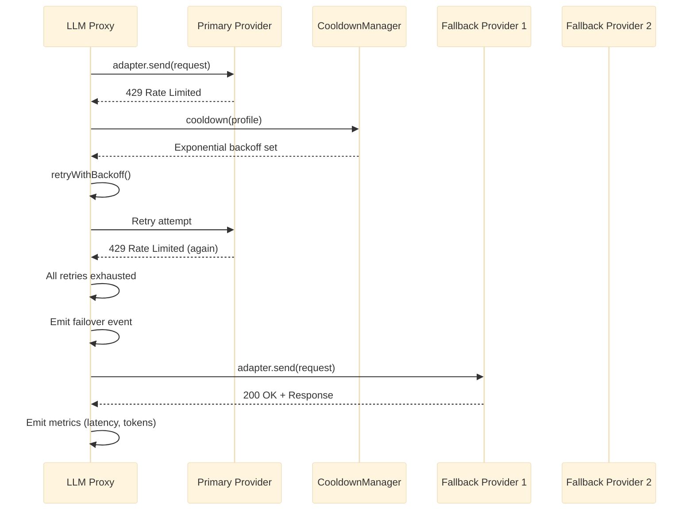

---

## Channels Architecture

Base adapter, platform-specific implementations, and bus integration.

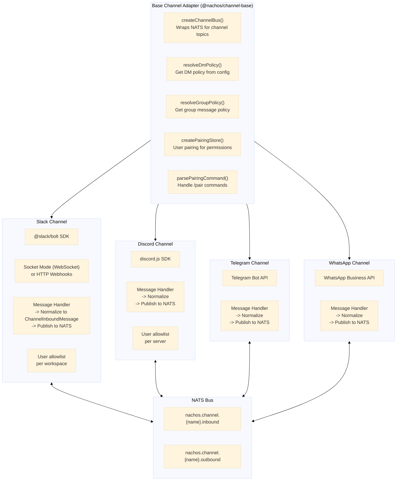

---

## Skills System

SKILL.md loading, prompt injection, exec flow, and tool group policy gating.

```mermaid
%%{init: {'theme': 'base'}}%%

flowchart TB
    subgraph SkillFiles["SKILL.md Files (skills/)"]
        GP["goplaces/SKILL.md\n----------\nname: goplaces\ngroup: lookup\nbins: [goplaces]\nenv: [GOOGLE_PLACES_API_KEY]"]
        GG["gifgrep/SKILL.md\n----------\nname: gifgrep\ngroup: media\nbins: [gifgrep]"]
        SM["summarize/SKILL.md\n----------\nname: summarize\ngroup: summarize\nbins: [summarize]"]
        G["gog/SKILL.md\n----------\nname: gog\ngroup: workspace\nbins: [gog]"]
    end

    subgraph Loader["SkillLoader"]
        Parse["Parse YAML frontmatter\n+ markdown body"]
        Filter["Filter by tool groups\n(policy-controlled)"]
        Inject["Inject into LLM\nsystem prompt"]
    end

    subgraph Execution["Execution Flow"]
        LLM["LLM reads SKILL.md\nin system prompt"]
        Call["LLM calls exec()\n{command: 'goplaces search coffee'}"]
        TC["ToolCoordinator\nevaluates policy"]
        LTH["LocalToolHandler\nroutes to ShellTool"]
        STExec["ShellTool\nspawns subprocess"]
        ResultExec["Output returned\nto LLM context"]
    end

    subgraph Groups["Tool Groups (Policy)"]
        Lookup["lookup\ngoplaces"]
        Media["media\ngifgrep"]
        SumGroup["summarize\nsummarize"]
        Workspace["workspace\ngog"]
    end

    SkillFiles --> Parse --> Filter --> Inject
    LLM --> Call --> TC --> LTH --> STExec
    STExec --> ResultExec --> LLM

    Groups -.->|Policy gating| TC
```

---

## Audit System

Event sources, composite provider fan-out, and audit event schema.

```mermaid
%%{init: {'theme': 'base'}}%%

flowchart TB
    subgraph Sources["Audit Event Sources"]
        GatewayA["Gateway\nSession events"]
        SalsaA["Salsa\nPolicy decisions"]
        ToolsA["ToolCoordinator\nTool executions"]
        StateLA["StateLayer\nState operations"]
        RouterA["Router\nMessage routing"]
    end

    subgraph Logger["AuditLogger"]
        Emit["emit(event)\nNormalize + timestamp"]
    end

    subgraph ProvidersA["Audit Providers"]
        Composite["CompositeAuditProvider\nFans out to multiple"]
        FileP["FileAuditProvider\nJSON lines to file"]
        SQLiteP["SQLiteAuditProvider\nStructured storage"]
        WebhookP["WebhookAuditProvider\nHTTP POST delivery"]
    end

    subgraph Event["AuditEvent"]
        Fields["eventId: UUID\ntimestamp: ISO\neventType: string\noutcome: allow|deny|error\nuserId: string\nsessionId: string\nresource: {type, id}\naction: string\nmetadata: Record\ndurationMs: number"]
    end

    Sources --> Logger
    Logger --> Composite
    Composite --> FileP & SQLiteP & WebhookP
    Logger -.-> Event
```

---

## Container Architecture

All containers with their base images, resource limits, and network assignments.

```mermaid
%%{init: {'theme': 'base'}}%%

flowchart TB
    subgraph Compose["Docker Compose"]
        subgraph Internal["nachos-internal (isolated, no external access)"]
            gateway["gateway\n--------\nnode:22-alpine\nnon-root, read-only FS\n512MB\n--------\nRouter, Salsa,\nToolCoord, SubagentOrch,\nContextMgr, StateLayer,\nAudit, DLP, ShellTool"]
            bus["bus\n--------\nnats:alpine\nnon-root\n256MB\n--------\nNATS Server\nPorts: 4222, 8222"]
            filesystem["filesystem\n--------\nnode:22-alpine\nnon-root\n128MB\n--------\nFile read/write"]
            coderunner["code-runner\n--------\nnode:22-alpine\nsandboxed\n512MB\n--------\nJS/Python execution"]
        end

        subgraph EgressNet["nachos-egress (controlled external access)"]
            llmproxy["llm-proxy\n--------\nnode:22-alpine\n-> LLM APIs only\n256MB\n--------\nAnthropic, OpenAI, Ollama"]
            webchat["webchat\n--------\nnode:22-alpine\n-> port 8080\n256MB"]
            slack["slack\n--------\nnode:22-alpine\n-> slack.com\n256MB"]
            discord["discord\n--------\nnode:22-alpine\n-> discord.com\n256MB"]
            telegram["telegram\n--------\nnode:22-alpine\n-> api.telegram.org\n256MB"]
            browser["browser\n--------\nplaywright\n-> configured domains\n1GB"]
            webfetch["web-fetch\n--------\nnode:22-alpine\n-> allowed URLs\n256MB\nSSRF protection"]
        end
    end

    subgraph Volumes["Volumes"]
        natsdata["nats-data"]
        sessionsdb["sessions.db"]
        policies["./policies"]
        workspace["./workspace"]
    end

    bus --- natsdata
    gateway --- sessionsdb
    gateway --- policies
    filesystem --- workspace

    Internal <-->|NATS| EgressNet
```

---

## Network Topology

External services, egress network, internal network, and host volume mounts.

```mermaid
%%{init: {'theme': 'base'}}%%

flowchart TB
    subgraph Internet["Internet"]
        anthropic["api.anthropic.com"]
        openai["api.openai.com"]
        slackapi["api.slack.com"]
        discordapi["discord.com/api"]
        telegramapi["api.telegram.org"]
        websites["Allowed websites"]
        googleapi["Google APIs"]
    end

    subgraph EgressNetDiag["nachos-egress (controlled external)"]
        llm["LLM Proxy\n-> anthropic, openai"]
        slackC["Slack\n-> slack.com"]
        discordC["Discord\n-> discord.com"]
        telegramC["Telegram\n-> telegram.org"]
        browserC["Browser\n-> configured domains"]
        webfetchC["Web Fetch\n-> allowed URLs"]
    end

    subgraph InternalNet["nachos-internal (no external access)"]
        gatewayN["Gateway"]
        busN["NATS Bus"]
        fs["Filesystem"]
        code["Code Runner"]
    end

    subgraph Host["Host Machine"]
        workspaceV["./workspace"]
        stateV["./state"]
        policiesV["./policies"]
    end

    llm <--> anthropic & openai
    slackC <--> slackapi
    discordC <--> discordapi
    telegramC <--> telegramapi
    browserC <--> websites
    webfetchC <--> websites
    gatewayN <-.-> googleapi

    EgressNetDiag <-->|NATS| InternalNet

    fs --- workspaceV
    gatewayN --- stateV & policiesV
```

---

## Configuration Flow

TOML loading, schema validation, env interpolation, hot-reload, and Docker Compose generation.

```mermaid
%%{init: {'theme': 'base'}}%%

flowchart LR
    subgraph Sources["Configuration Sources"]
        TOML["nachos.toml\n(primary config)"]
        ENV[".env file\n+ shell env vars"]
        CLI["CLI flags\n(overrides)"]
    end

    subgraph Loader["@nachos/config"]
        LoadTOML["loader.ts\nParse TOML from disk"]
        Schema["schema.ts\nNachosConfig schema"]
        Validate["validation.ts\nValidate against schema"]
        EnvOverlay["env.ts\nEnvironment variable\ninterpolation"]
        RuntimeOL["runtime-overlay.ts\nRuntime state persistence"]
        Merge["Merge all sources\nCLI > ENV > TOML"]
    end

    subgraph HotReload["Hot Reload"]
        Watch["hotreload.ts\nFile watcher"]
        RegistryHR["registry.ts\nNotify subscribers"]
        Publish["Bus: nachos.config.updated"]
    end

    subgraph Output["Validated Config"]
        NachosConfig["NachosConfig\n- nachos (name, version)\n- llm (provider, model, profiles)\n- channels (slack, discord, etc.)\n- security (mode, audit)\n- tools (browser, filesystem, etc.)\n- context (sliding_window, etc.)"]
    end

    subgraph Generated["Generated Artifacts"]
        ComposeOut["docker-compose.yml"]
        Networks["Network definitions"]
        VolumeDefs["Volume mounts"]
        SecretInject["Secret injection"]
    end

    TOML --> LoadTOML --> Validate
    Schema --> Validate
    ENV --> EnvOverlay
    CLI --> Merge
    Validate --> EnvOverlay --> Merge --> RuntimeOL --> NachosConfig

    NachosConfig --> ComposeOut & Networks & VolumeDefs & SecretInject

    TOML -->|File change| Watch --> RegistryHR --> Publish
```

---

## Security Gate Sequence

Every request passes through 8 security checkpoints in order.

```mermaid
%%{init: {'theme': 'base'}}%%

flowchart TD
    Req["Incoming Request"] --> RL

    subgraph Gates["Security Gates (in order)"]
        RL["1. Rate Limiter\nToken bucket per user/action"]
        Policy["2. Salsa Policy Check\nresource + action + conditions"]
        DLPScan["3. DLP Scanner\nSensitive data detection"]
        ToolPolicy["4. Tool Policy Check\nTool-specific rules"]
        Approval["5. Approval Manager\n(RESTRICTED tier only)"]
        Cache["6. Tool Cache\nSkip if cached"]
        StatePolicy["7. State Layer Policy\nAccess control on state ops"]
        Audit["8. Audit Logger\nRecord all events"]
    end

    RL -->|Under limit| Policy
    RL -->|Over limit| Throttled["Throttled"]

    Policy -->|Allowed| DLPScan
    Policy -->|Denied| Denied1["Denied"]

    DLPScan -->|Clean| ToolPolicy
    DLPScan -->|Sensitive| Blocked["Blocked + Redacted"]

    ToolPolicy -->|Allowed| Approval
    ToolPolicy -->|Denied| Denied2["Denied"]

    Approval -->|Approved| Cache
    Approval -->|Denied| Denied3["Denied"]

    Cache -->|Hit| CacheResult["Cached Result"]
    Cache -->|Miss| ExecuteGate["Execute"]

    ExecuteGate --> StatePolicy
    StatePolicy -->|Allowed| Audit
    StatePolicy -->|Denied| Denied4["Denied"]

    Audit --> Done["Complete"]

    Throttled & Denied1 & Denied2 & Denied3 & Blocked & Denied4 --> Audit
```

---

## Session Lifecycle

Full state machine including the active sub-states (processing, waiting for LLM, executing tools).

```mermaid
%%{init: {'theme': 'base'}}%%

stateDiagram-v2
    [*] --> Created: getOrCreateSession()

    Created --> Active: First message

    Active --> Active: Message exchange
    Active --> Active: Tool execution
    Active --> Active: Context compaction
    Active --> Paused: User timeout

    Active --> Ended: /end command
    Active --> Ended: Session expired

    Paused --> Active: New message
    Paused --> Ended: Extended timeout

    Ended --> [*]

    state Active {
        [*] --> Processing
        Processing --> WaitingForLLM: sendLLMRequest()
        WaitingForLLM --> Processing: LLM response
        WaitingForLLM --> ExecutingTools: tool_calls in response
        ExecutingTools --> WaitingForLLM: Tool results follow-up LLM
        Processing --> [*]: Send response to channel
    }

    note right of Active
        Messages stored in SQLite
        Context budget tracked
        Tools available per policy
        State layer accessible
    end note

    note right of Paused
        State preserved in DB
        No active processing
        Can resume seamlessly
    end note
```

---

## Monorepo Package Graph

All `@nachos/*` packages and their dependency relationships.

```mermaid
%%{init: {'theme': 'base'}}%%

flowchart BT
    subgraph Shared["Shared Packages"]
        Types["@nachos/types\nSchemas, interfaces,\nerror definitions"]
        Utils["@nachos/utils\nUtility functions"]
        ConfigPkg["@nachos/config\nTOML loading,\nvalidation, hot-reload"]
        CtxMgrPkg["@nachos/context-manager\nBudget, sliding window,\nextraction, summarization"]
        ToolBasePkg["@nachos/tool-base\nTool interface\nabstractions"]
    end

    subgraph Core["Core Packages"]
        BusPkg["@nachos/bus\nNATS client wrapper"]
        GatewayPkg["@nachos/gateway\nRouter, Sessions, Salsa,\nTools, Subagents, State"]
        LLMProxyPkg["@nachos/llm-proxy\nProvider adapters,\nretry, cooldowns"]
    end

    subgraph ChannelsPkg["Channel Packages"]
        ChBase["@nachos/channel-base\nPolicy, pairing, factory"]
        ChSlack["@nachos/channel-slack"]
        ChDiscord["@nachos/channel-discord"]
        ChTelegram["@nachos/channel-telegram"]
        ChWhatsApp["@nachos/channel-whatsapp"]
    end

    subgraph ToolsPkg["Tool Packages"]
        TBrowser["@nachos/tool-browser"]
        TFS["@nachos/tool-filesystem"]
        TCode["@nachos/tool-code-runner"]
        TFetch["@nachos/tool-web-fetch"]
        TCopilot["@nachos/tool-copilot"]
        TMCP["@nachos/tool-claude-code-mcp"]
    end

    subgraph CLIPkg["CLI"]
        NachosCLI["@nachos/cli\nCommander.js"]
    end

    Types --> Utils
    Types --> ConfigPkg
    Types --> CtxMgrPkg
    Types --> ToolBasePkg
    Types --> BusPkg

    BusPkg --> GatewayPkg
    ConfigPkg --> GatewayPkg
    CtxMgrPkg --> GatewayPkg
    ToolBasePkg --> GatewayPkg

    BusPkg --> LLMProxyPkg

    ChBase --> ChSlack & ChDiscord & ChTelegram & ChWhatsApp
    BusPkg --> ChBase

    ToolBasePkg --> TBrowser & TFS & TCode & TFetch & TCopilot & TMCP
    BusPkg --> TBrowser & TFS & TCode & TFetch & TCopilot & TMCP

    ConfigPkg --> NachosCLI
    Types --> NachosCLI
```

---

## CLI Command Tree

Full command hierarchy including subagent and memory management.

```mermaid
%%{init: {'theme': 'base'}}%%

flowchart TD
    nachos["nachos"]

    nachos --> init["init\nInitialize config"]
    nachos --> up["up [services...]\nStart stack"]
    nachos --> down["down\nStop stack"]
    nachos --> restart["restart [service]\nRestart service"]
    nachos --> logs["logs [service]\nAggregated logs"]
    nachos --> status["status\nService health"]

    nachos --> add["add"]
    add --> add_channel["channel name"]
    add --> add_tool["tool name"]

    nachos --> remove["remove"]
    remove --> rm_channel["channel name"]
    remove --> rm_tool["tool name"]

    nachos --> list["list [type]"]
    nachos --> search["search type"]

    nachos --> config["config"]
    config --> config_edit["edit"]
    config --> config_validate["validate"]
    config --> config_show["show"]

    nachos --> policy["policy"]
    policy --> policy_validate["validate"]

    nachos --> doctor["doctor\nDiagnostics"]
    nachos --> version["version"]

    nachos --> create["create"]
    create --> create_channel["channel name"]
    create --> create_tool["tool name"]

    nachos --> chat["chat\nInteractive"]

    nachos --> subagents["subagents"]
    subagents --> sa_list["list"]
    subagents --> sa_info["info runId"]
    subagents --> sa_stop["stop runId"]

    nachos --> memory["memory"]
    memory --> mem_list["list"]
    memory --> mem_query["query"]
```
