# Architecture Diagrams

Internal reference for the Nachos team. All diagrams are interactive — zoom and pan with the controls that appear on hover.

**Jump to:** [System Overview](#system-overview) | [Gateway](#gateway-internals) | [Message Flow](#message-flow) | [Policy Engine](#cheese-policy-engine) | [Context Management](#context-management) | [Tool Execution](#tool-execution) | [Subagents](#subagent-system) | [State Layer](#state-layer) | [Bus](#nats-message-bus) | [LLM Proxy](#llm-proxy) | [Channels](#channels-architecture) | [Skills](#skills-system) | [Audit](#audit-system) | [Containers](#container-architecture) | [Network](#network-topology) | [Config Flow](#configuration-flow) | [Security Gates](#security-gate-sequence) | [Session Lifecycle](#session-lifecycle) | [Package Graph](#monorepo-package-graph) | [CLI Tree](#cli-command-tree)

---

## System Overview

Full stack: users, channels, core layer, LLM layer, tools, skills, and external services.

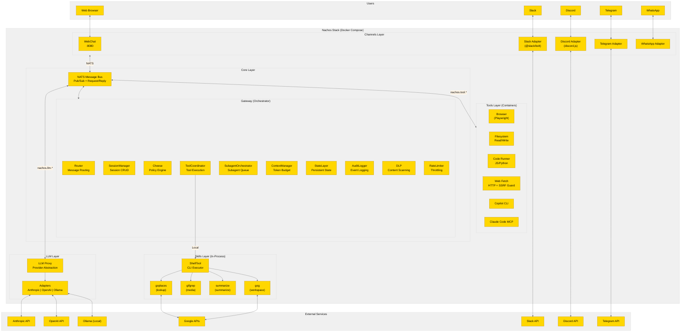
```mermaid
%%{init: {'theme': 'base', 'themeVariables': { 'primaryColor': '#ffd700', 'primaryTextColor': '#000', 'primaryBorderColor': '#b8860b', 'lineColor': '#666', 'secondaryColor': '#fff5e6', 'tertiaryColor': '#f0f0f0'}}}%%

flowchart TB
    subgraph Users["Users"]
        WebUser["Web Browser"]
        SlackUser["Slack"]
        DiscordUser["Discord"]
        TelegramUser["Telegram"]
        WhatsAppUser["WhatsApp"]
    end

    subgraph Nachos["Nachos Stack (Docker Compose)"]
        subgraph Channels["Channels Layer"]
            WebChat["WebChat<br/>:8080"]
            Slack["Slack Adapter<br/>(@slack/bolt)"]
            Discord["Discord Adapter<br/>(discord.js)"]
            Telegram["Telegram Adapter"]
            WhatsApp["WhatsApp Adapter"]
        end

        subgraph CoreLayer["Core Layer"]
            subgraph GatewayBox["Gateway (Orchestrator)"]
                Router["Router<br/>Message Routing"]
                SessionMgr["SessionManager<br/>Session CRUD"]
                Cheese["Cheese<br/>Policy Engine"]
                ToolCoord["ToolCoordinator<br/>Tool Execution"]
                SubagentOrch["SubagentOrchestrator<br/>Subagent Queue"]
                CtxMgr["ContextManager<br/>Token Budget"]
                StateLayer["StateLayer<br/>Persistent State"]
                AuditLog["AuditLogger<br/>Event Logging"]
                DLP["DLP<br/>Content Scanning"]
                RateLim["RateLimiter<br/>Throttling"]
            end
            Bus["NATS Message Bus<br/>Pub/Sub + Request/Reply"]
        end

        subgraph LLMLayer["LLM Layer"]
            LLMProxy["LLM Proxy<br/>Provider Abstraction"]
            Adapters["Adapters<br/>Anthropic | OpenAI | Ollama"]
        end

        subgraph ToolsLayer["Tools Layer (Containers)"]
            BrowserTool["Browser<br/>(Playwright)"]
            FSTool["Filesystem<br/>Read/Write"]
            CodeRunner["Code Runner<br/>JS/Python"]
            WebFetchTool["Web Fetch<br/>HTTP + SSRF Guard"]
            CopilotTool["Copilot CLI"]
            ClaudeCodeMCP["Claude Code MCP"]
        end

        subgraph SkillsLayer["Skills Layer (In-Process)"]
            ShellTool["ShellTool<br/>CLI Executor"]
            GoPlaces["goplaces<br/>(lookup)"]
            GifGrep["gifgrep<br/>(media)"]
            Summarize["summarize<br/>(summarize)"]
            Gog["gog<br/>(workspace)"]
        end
    end

    subgraph External["External Services"]
        Anthropic["Anthropic API"]
        OpenAI["OpenAI API"]
        Ollama["Ollama (Local)"]
        SlackAPI["Slack API"]
        DiscordAPI["Discord API"]
        TelegramAPI["Telegram API"]
        GoogleAPI["Google APIs"]
    end

    WebUser <--> WebChat
    SlackUser <--> Slack
    DiscordUser <--> Discord
    TelegramUser <--> Telegram
    WhatsAppUser <--> WhatsApp

    Channels <-->|NATS| Bus
    Bus <--> GatewayBox
    Bus <-->|nachos.llm.*| LLMProxy
    LLMProxy --> Adapters
    Bus <-->|nachos.tool.*| ToolsLayer

    ToolCoord -->|Local| ShellTool
    ShellTool --> GoPlaces & GifGrep & Summarize & Gog

    Adapters <--> Anthropic & OpenAI & Ollama
    Slack <--> SlackAPI
    Discord <--> DiscordAPI
    Telegram <--> TelegramAPI
    GoPlaces & Gog <--> GoogleAPI
```

---

## Gateway Internals

The gateway is the central orchestrator. Every subsystem initializes from `GatewayOptions` at startup.

```mermaid
%%{init: {'theme': 'base'}}%%

flowchart TB
    subgraph Gateway["Gateway (core/gateway)"]
        direction TB

        subgraph Init["Initialization"]
            Config["GatewayOptions<br/>dbPath, healthPort, bus,<br/>channels[], policyConfig,<br/>auditConfig, dlpConfig, etc."]
        end

        subgraph Routing["Message Routing"]
            Router["Router<br/>- registerHandler()<br/>- route()<br/>- subscribeToChannel()<br/>- processInboundMessage()<br/>- sendLLMRequest()<br/>- sendToolRequest()<br/>- sendToChannel()<br/>- checkAndCompactContext()"]
            RateLimiter["RateLimiter<br/>Token bucket<br/>per user/action"]
        end

        subgraph Sessions["Session Management"]
            SessionManager["SessionManager<br/>- getOrCreateSession()<br/>- addMessage()<br/>- replaceMessages()<br/>- getSessionWithMessages()"]
            StateStorage["StateStorage<br/>(SQLite via better-sqlite3)<br/>Tables: sessions, messages"]
        end

        subgraph Security["Security"]
            Cheese["Cheese Policy Engine<br/>- evaluate()<br/>- reload()<br/>- getStats()"]
            DLPLayer["DLP Security Layer<br/>Content scanning<br/>Sensitive data detection"]
            AuditLogger["AuditLogger<br/>File | SQLite | Webhook<br/>Composite provider"]
        end

        subgraph ToolExec["Tool Execution"]
            ToolCoordinator["ToolCoordinator<br/>- executeTools()<br/>- executeSingle()<br/>Parallel/Sequential routing"]
            LocalToolHandler["LocalToolHandler<br/>exec/shell -> ShellTool"]
            ToolCache["ToolCache<br/>Result caching + TTL"]
            ApprovalManager["ApprovalManager<br/>User confirmation for<br/>RESTRICTED tier tools"]
        end

        subgraph Context["Context Management"]
            CtxManager["ContextManager<br/>- checkBeforeTurn()<br/>- compact()"]
            MemoryPipeline["MemoryPipeline<br/>Proactive history extraction"]
        end

        subgraph Agents["Subagent System"]
            SubagentMgr["SubagentManager<br/>- run(task)<br/>Modes: full | host"]
            SubagentOrch["SubagentOrchestrator<br/>- enqueue()<br/>- drainQueue()<br/>- announce()"]
            DockerSandbox["DockerSubagentSandbox<br/>Full container isolation"]
            SandboxMgr["SandboxManager<br/>Manages sandbox lifecycle"]
        end

        subgraph State["Persistent State"]
            SL["StateLayer<br/>Composed stores"]
            PromptAsm["PromptAssembler<br/>System prompt assembly"]
        end

        subgraph Stream["Streaming"]
            StreamMap["streamingSessions<br/>Map of sessionId to stream"]
        end
    end

    Config --> Router & SessionManager & Cheese & ToolCoordinator & SubagentOrch & SL
    Router --> RateLimiter
    Router --> CtxManager
    SessionManager --> StateStorage
    ToolCoordinator --> Cheese & LocalToolHandler & ToolCache & ApprovalManager
    SubagentOrch --> SubagentMgr
    SubagentMgr --> DockerSandbox
    SL --> PromptAsm
```

---

## Message Flow

Full sequence: user message through rate limiting, policy, DLP, session, context management, LLM, tool execution, and response delivery.

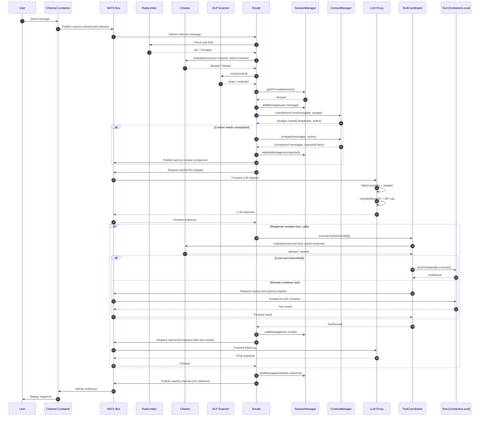
```mermaid
sequenceDiagram
    autonumber
    participant U as User
    participant Ch as Channel Container
    participant Bus as NATS Bus
    participant RL as RateLimiter
    participant S as Cheese
    participant DLP as DLP Scanner
    participant R as Router
    participant SM as SessionManager
    participant CM as ContextManager
    participant LP as LLM Proxy
    participant TC as ToolCoordinator
    participant T as Tool (Container/Local)

    U->>Ch: Send message
    Ch->>Bus: Publish nachos.channel.{ch}.inbound

    Bus->>R: Deliver inbound message
    R->>RL: Check rate limit
    RL-->>R: OK / Throttled

    R->>S: evaluate(resource=channel, action=receive)
    S-->>R: allowed / denied

    R->>DLP: scan(content)
    DLP-->>R: clean / redacted

    R->>SM: getOrCreateSession()
    SM-->>R: Session
    R->>SM: addMessage(user message)

    R->>CM: checkBeforeTurn(messages, budget)
    CM-->>R: {budget, needsCompaction, action}

    alt Context needs compaction
        R->>CM: compact(messages, action)
        CM-->>R: {compacted messages, extracted facts}
        R->>SM: replaceMessages(compacted)
        R->>Bus: Publish nachos.context.compaction
    end

    R->>Bus: Request nachos.llm.request
    Bus->>LP: Forward LLM request
    LP->>LP: Select provider + adapter
    LP->>LP: retryWithBackoff -> API call
    LP-->>Bus: LLM response
    Bus-->>R: Forward response

    alt Response contains tool_calls
        R->>TC: executeTools(toolCalls[])
        TC->>S: evaluate(resource=tool, action=execute)
        S-->>TC: allowed / denied

        alt Local tool (exec/shell)
            TC->>T: localToolHandler.execute()
            T-->>TC: ToolResult
        else Remote container tool
            TC->>Bus: Request nachos.tool.{name}.request
            Bus->>T: Forward to tool container
            T-->>Bus: Tool result
            Bus-->>TC: Forward result
        end

        TC-->>R: ToolResult[]
        R->>SM: addMessage(tool results)
        R->>Bus: Request nachos.llm.request (with tool results)
        Bus->>LP: Forward follow-up
        LP-->>Bus: Final response
        Bus-->>R: Forward
    end

    R->>SM: addMessage(assistant response)
    R->>Bus: Publish nachos.channel.{ch}.outbound
    Bus->>Ch: Deliver outbound
    Ch->>U: Display response
```

---

## Cheese Policy Engine

Policy loading, evaluation, condition matching, and decision output.

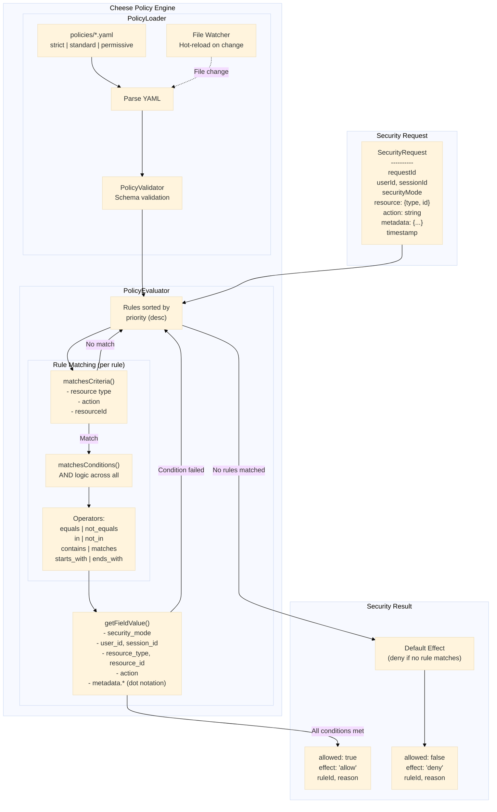
```mermaid
%%{init: {'theme': 'base'}}%%

flowchart TB
    subgraph Input["Security Request"]
        Req["SecurityRequest<br/>----------<br/>requestId<br/>userId, sessionId<br/>securityMode<br/>resource: {type, id}<br/>action: string<br/>metadata: {...}<br/>timestamp"]
    end

    subgraph Cheese["Cheese Policy Engine"]

        subgraph Loader["PolicyLoader"]
            YAML["policies/*.yaml<br/>strict | standard | permissive"]
            Parse["Parse YAML"]
            Validate["PolicyValidator<br/>Schema validation"]
            HotReload["File Watcher<br/>Hot-reload on change"]
        end

        subgraph Evaluator["PolicyEvaluator"]
            PrioritySort["Rules sorted by<br/>priority (desc)"]

            subgraph RuleMatch["Rule Matching (per rule)"]
                Criteria["matchesCriteria()<br/>- resource type<br/>- action<br/>- resourceId"]
                Conditions["matchesConditions()<br/>AND logic across all"]
                Operators["Operators:<br/>equals | not_equals<br/>in | not_in<br/>contains | matches<br/>starts_with | ends_with"]
            end

            FieldRes["getFieldValue()<br/>- security_mode<br/>- user_id, session_id<br/>- resource_type, resource_id<br/>- action<br/>- metadata.* (dot notation)"]
        end
    end

    subgraph Output["Security Result"]
        Allow["allowed: true<br/>effect: 'allow'<br/>ruleId, reason"]
        Deny["allowed: false<br/>effect: 'deny'<br/>ruleId, reason"]
        Default["Default Effect<br/>(deny if no rule matches)"]
    end

    YAML --> Parse --> Validate --> PrioritySort
    HotReload -.->|File change| Parse

    Req --> PrioritySort
    PrioritySort --> Criteria
    Criteria -->|Match| Conditions
    Criteria -->|No match| PrioritySort
    Conditions --> Operators
    Operators --> FieldRes
    FieldRes -->|All conditions met| Allow
    FieldRes -->|Condition failed| PrioritySort
    PrioritySort -->|No rules matched| Default
    Default --> Deny
```

### Policy Rule Class Diagram

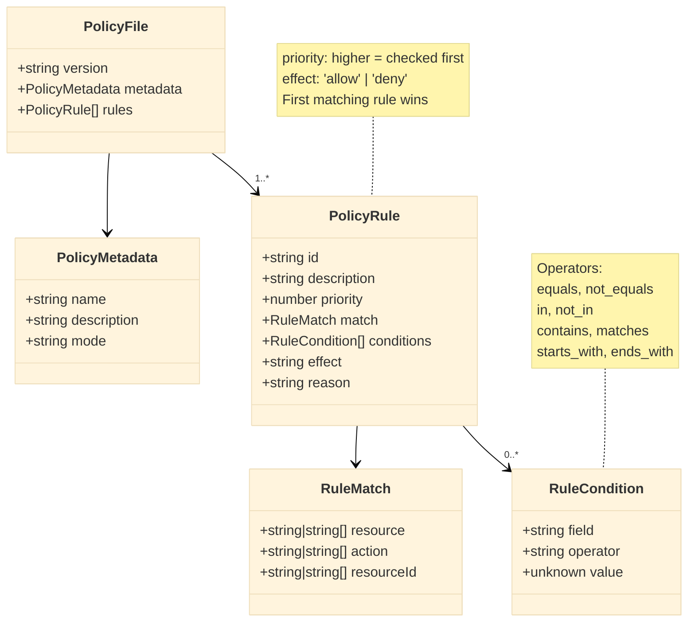
```mermaid
%%{init: {'theme': 'base'}}%%

classDiagram
    class PolicyFile {
        +string version
        +PolicyMetadata metadata
        +PolicyRule[] rules
    }

    class PolicyMetadata {
        +string name
        +string description
        +string mode
    }

    class PolicyRule {
        +string id
        +string description
        +number priority
        +RuleMatch match
        +RuleCondition[] conditions
        +string effect
        +string reason
    }

    class RuleMatch {
        +string|string[] resource
        +string|string[] action
        +string|string[] resourceId
    }

    class RuleCondition {
        +string field
        +string operator
        +unknown value
    }

    PolicyFile --> PolicyMetadata
    PolicyFile --> "1..*" PolicyRule
    PolicyRule --> RuleMatch
    PolicyRule --> "0..*" RuleCondition

    note for PolicyRule "priority: higher = checked first<br/>effect: 'allow' | 'deny'<br/>First matching rule wins"

    note for RuleCondition "Operators:<br/>equals, not_equals<br/>in, not_in<br/>contains, matches<br/>starts_with, ends_with"
```

### Security Modes Comparison

```mermaid
%%{init: {'theme': 'base'}}%%

flowchart LR
    subgraph Strict["Strict Mode (default)"]
        S1["All tools disabled"]
        S2["Allowlisted DMs only"]
        S3["Full audit logging"]
        S4["No network egress"]
    end

    subgraph Standard["Standard Mode"]
        ST1["Common tools enabled"]
        ST2["Pairing-based DM access"]
        ST3["Selective audit"]
        ST4["Controlled egress"]
    end

    subgraph Permissive["Permissive Mode"]
        P1["All tools enabled"]
        P2["Full channel access"]
        P3["Minimal audit"]
        P4["Full network access"]
    end

    Strict ---|"Opt-in"| Standard ---|"Explicit opt-in"| Permissive
```

---

## Context Management

Budget zones, sliding window compaction, memory extraction pipeline, and bus events.

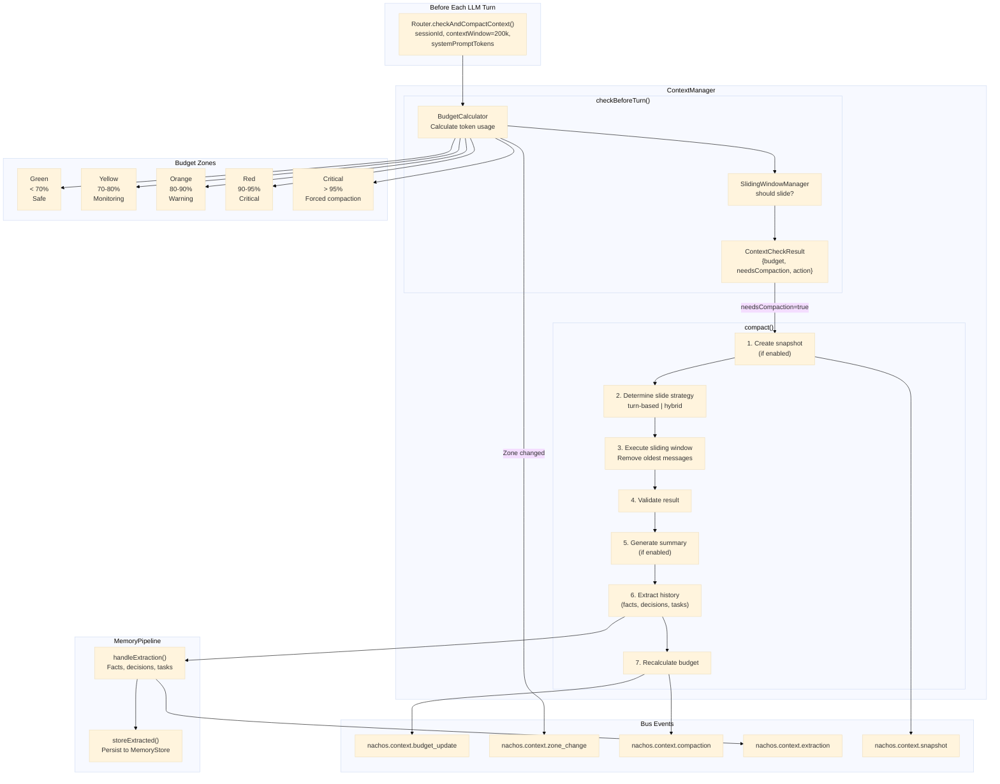
```mermaid
%%{init: {'theme': 'base'}}%%

flowchart TB
    subgraph Trigger["Before Each LLM Turn"]
        RouterCall["Router.checkAndCompactContext()<br/>sessionId, contextWindow=200k,<br/>systemPromptTokens"]
    end

    subgraph CM["ContextManager"]
        subgraph Check["checkBeforeTurn()"]
            Budget["BudgetCalculator<br/>Calculate token usage"]
            Sliding["SlidingWindowManager<br/>should slide?"]
            Result["ContextCheckResult<br/>{budget, needsCompaction, action}"]
        end

        subgraph Compact["compact()"]
            Snapshot["1. Create snapshot<br/>(if enabled)"]
            Strategy["2. Determine slide strategy<br/>turn-based | hybrid"]
            Execute["3. Execute sliding window<br/>Remove oldest messages"]
            ValidateC["4. Validate result"]
            Summarize["5. Generate summary<br/>(if enabled)"]
            Extract["6. Extract history<br/>(facts, decisions, tasks)"]
            Recalc["7. Recalculate budget"]
        end
    end

    subgraph Zones["Budget Zones"]
        Green["Green<br/>< 70%<br/>Safe"]
        Yellow["Yellow<br/>70-80%<br/>Monitoring"]
        Orange["Orange<br/>80-90%<br/>Warning"]
        Red["Red<br/>90-95%<br/>Critical"]
        Critical["Critical<br/>> 95%<br/>Forced compaction"]
    end

    subgraph Pipeline["MemoryPipeline"]
        MemExtract["handleExtraction()<br/>Facts, decisions, tasks"]
        MemStore["storeExtracted()<br/>Persist to MemoryStore"]
    end

    subgraph Events["Bus Events"]
        E1["nachos.context.budget_update"]
        E2["nachos.context.zone_change"]
        E3["nachos.context.compaction"]
        E4["nachos.context.extraction"]
        E5["nachos.context.snapshot"]
    end

    RouterCall --> Budget
    Budget --> Sliding
    Sliding --> Result

    Result -->|needsCompaction=true| Snapshot
    Snapshot --> Strategy --> Execute --> ValidateC --> Summarize --> Extract --> Recalc

    Budget --> Green & Yellow & Orange & Red & Critical

    Extract --> MemExtract --> MemStore

    Recalc --> E1 & E3
    Budget -->|Zone changed| E2
    MemExtract --> E4
    Snapshot --> E5
```

### Sliding Window Configuration

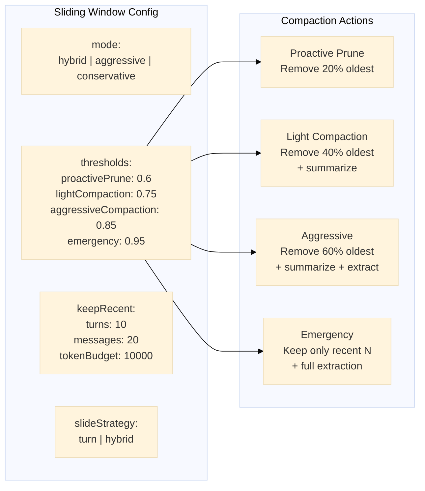
```mermaid
%%{init: {'theme': 'base'}}%%

flowchart LR
    subgraph Config["Sliding Window Config"]
        Mode["mode:<br/>hybrid | aggressive | conservative"]
        Thresholds["thresholds:<br/>proactivePrune: 0.6<br/>lightCompaction: 0.75<br/>aggressiveCompaction: 0.85<br/>emergency: 0.95"]
        KeepRecent["keepRecent:<br/>turns: 10<br/>messages: 20<br/>tokenBudget: 10000"]
        SlideStrat["slideStrategy:<br/>turn | hybrid"]
    end

    subgraph Actions["Compaction Actions"]
        Proactive["Proactive Prune<br/>Remove 20% oldest"]
        Light["Light Compaction<br/>Remove 40% oldest<br/>+ summarize"]
        Aggressive["Aggressive<br/>Remove 60% oldest<br/>+ summarize + extract"]
        Emergency["Emergency<br/>Keep only recent N<br/>+ full extraction"]
    end

    Thresholds --> Proactive & Light & Aggressive & Emergency
```

---

## Tool Execution

Security tier resolution, policy checks, approval gates, caching, and local vs. remote routing.

```mermaid
%%{init: {'theme': 'base'}}%%

flowchart TB
    subgraph LLMResponse["LLM Response"]
        ToolCalls["tool_calls[]<br/>{id, name, input}"]
    end

    subgraph TC["ToolCoordinator"]
        Detect["canExecuteInParallel()<br/>- Duplicate tools? -> sequential<br/>- Write-then-read? -> sequential<br/>- Otherwise -> parallel"]

        subgraph Single["executeSingle(call)"]
            ResolveTier["Resolve Security Tier<br/>- code_runner -> RESTRICTED<br/>- filesystem_write -> ELEVATED<br/>- browser -> STANDARD<br/>- read/list -> SAFE"]

            PolicyCheck["Cheese Policy Check<br/>evaluate(resource=tool,<br/>action=execute)"]

            ApprovalCheck["Approval Check<br/>(if RESTRICTED tier)"]

            CacheCheck["Cache Check<br/>cache.get(call)"]

            subgraph Route["Execution Route"]
                IsLocal{"isLocalTool?<br/>(exec/shell)"}
                Local["LocalToolHandler<br/>-> ShellTool"]
                Remote["Bus Request<br/>nachos.tool.{name}.request"]
            end

            CacheSet["Cache Set<br/>cache.set(call, result, ttl)"]
        end
    end

    subgraph Results["Tool Results"]
        Success["ToolResult<br/>success: true<br/>content, duration"]
        Error["ToolResult<br/>success: false<br/>error code + message"]
    end

    ToolCalls --> Detect
    Detect -->|Parallel| Single
    Detect -->|Sequential| Single

    Single --> ResolveTier --> PolicyCheck
    PolicyCheck -->|Denied| Error
    PolicyCheck -->|Allowed| ApprovalCheck
    ApprovalCheck -->|Denied| Error
    ApprovalCheck -->|Approved| CacheCheck
    CacheCheck -->|Hit| Success
    CacheCheck -->|Miss| IsLocal
    IsLocal -->|Yes| Local --> Success
    IsLocal -->|No| Remote --> Success
    Success --> CacheSet
```

### Security Tiers

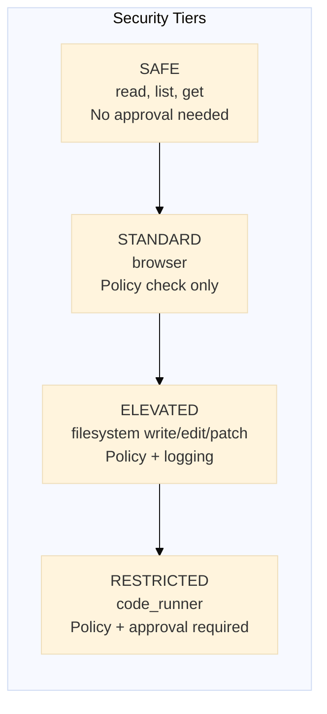
```mermaid
%%{init: {'theme': 'base'}}%%

flowchart LR
    subgraph Tiers["Security Tiers"]
        Safe["SAFE<br/>read, list, get<br/>No approval needed"]
        Standard["STANDARD<br/>browser<br/>Policy check only"]
        Elevated["ELEVATED<br/>filesystem write/edit/patch<br/>Policy + logging"]
        Restricted["RESTRICTED<br/>code_runner<br/>Policy + approval required"]
    end

    Safe --> Standard --> Elevated --> Restricted
```

### Shell Tool (Skills Execution)

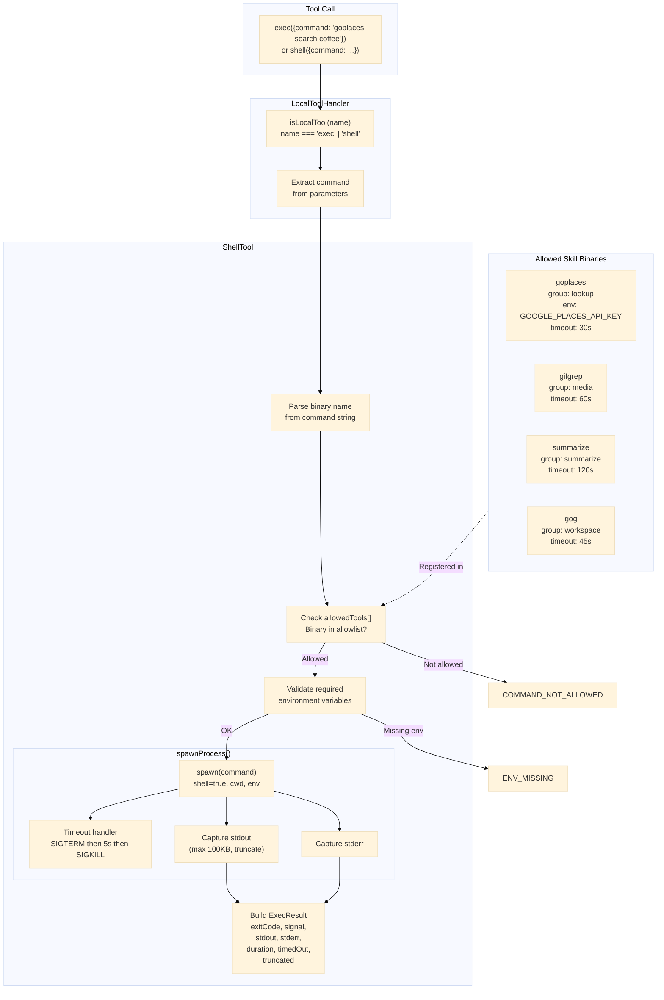
```mermaid
%%{init: {'theme': 'base'}}%%

flowchart TB
    subgraph Input["Tool Call"]
        ExecCall["exec({command: 'goplaces search coffee'})<br/>or shell({command: ...})"]
    end

    subgraph LTH["LocalToolHandler"]
        IsLocal["isLocalTool(name)<br/>name === 'exec' | 'shell'"]
        ExtractCmd["Extract command<br/>from parameters"]
    end

    subgraph ST["ShellTool"]
        ParseBin["Parse binary name<br/>from command string"]
        CheckAllowed["Check allowedTools[]<br/>Binary in allowlist?"]
        CheckEnv["Validate required<br/>environment variables"]

        subgraph Spawn["spawnProcess()"]
            ChildProc["spawn(command)<br/>shell=true, cwd, env"]
            Timeout["Timeout handler<br/>SIGTERM then 5s then SIGKILL"]
            StdOut["Capture stdout<br/>(max 100KB, truncate)"]
            StdErr["Capture stderr"]
        end

        BuildResult["Build ExecResult<br/>exitCode, signal,<br/>stdout, stderr,<br/>duration, timedOut,<br/>truncated"]
    end

    subgraph Skills["Allowed Skill Binaries"]
        GP["goplaces<br/>group: lookup<br/>env: GOOGLE_PLACES_API_KEY<br/>timeout: 30s"]
        GG["gifgrep<br/>group: media<br/>timeout: 60s"]
        Sum["summarize<br/>group: summarize<br/>timeout: 120s"]
        G["gog<br/>group: workspace<br/>timeout: 45s"]
    end

    ExecCall --> IsLocal --> ExtractCmd --> ParseBin --> CheckAllowed
    CheckAllowed -->|Not allowed| ErrorOut["COMMAND_NOT_ALLOWED"]
    CheckAllowed -->|Allowed| CheckEnv
    CheckEnv -->|Missing env| ErrorOut2["ENV_MISSING"]
    CheckEnv -->|OK| ChildProc
    ChildProc --> Timeout & StdOut & StdErr
    StdOut & StdErr --> BuildResult

    Skills -.->|Registered in| CheckAllowed
```

---

## Subagent System

Queue-based orchestration, sandbox modes, and child session management.

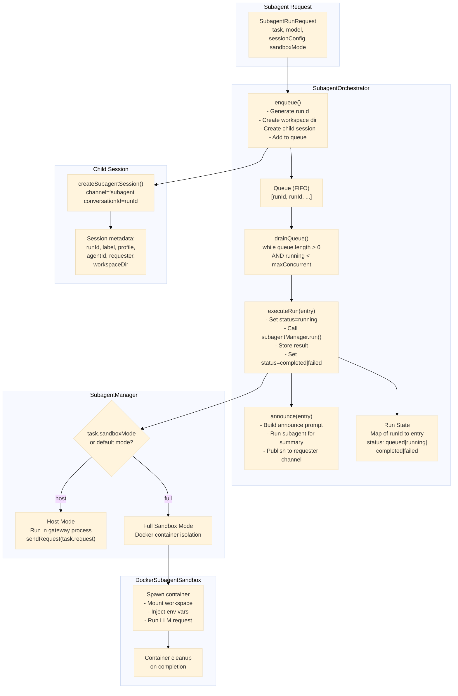
```mermaid
%%{init: {'theme': 'base'}}%%

flowchart TB
    subgraph Request["Subagent Request"]
        Req["SubagentRunRequest<br/>task, model,<br/>sessionConfig,<br/>sandboxMode"]
    end

    subgraph Orchestrator["SubagentOrchestrator"]
        Enqueue["enqueue()<br/>- Generate runId<br/>- Create workspace dir<br/>- Create child session<br/>- Add to queue"]

        Queue["Queue (FIFO)<br/>[runId, runId, ...]"]

        Drain["drainQueue()<br/>while queue.length > 0<br/>AND running < maxConcurrent"]

        ExecRun["executeRun(entry)<br/>- Set status=running<br/>- Call subagentManager.run()<br/>- Store result<br/>- Set status=completed|failed"]

        Announce["announce(entry)<br/>- Build announce prompt<br/>- Run subagent for summary<br/>- Publish to requester channel"]

        State["Run State<br/>Map of runId to entry<br/>status: queued|running|<br/>completed|failed"]
    end

    subgraph Manager["SubagentManager"]
        ModeCheck{"task.sandboxMode<br/>or default mode?"}
        HostMode["Host Mode<br/>Run in gateway process<br/>sendRequest(task.request)"]
        FullMode["Full Sandbox Mode<br/>Docker container isolation"]
    end

    subgraph Docker["DockerSubagentSandbox"]
        Container["Spawn container<br/>- Mount workspace<br/>- Inject env vars<br/>- Run LLM request"]
        Cleanup["Container cleanup<br/>on completion"]
    end

    subgraph Session["Child Session"]
        Create["createSubagentSession()<br/>channel='subagent'<br/>conversationId=runId"]
        Meta["Session metadata:<br/>runId, label, profile,<br/>agentId, requester,<br/>workspaceDir"]
    end

    Req --> Enqueue
    Enqueue --> Queue
    Enqueue --> Create --> Meta
    Queue --> Drain
    Drain --> ExecRun
    ExecRun --> ModeCheck
    ModeCheck -->|host| HostMode
    ModeCheck -->|full| FullMode --> Container --> Cleanup
    ExecRun --> Announce
    ExecRun --> State
```

### Subagent Lifecycle

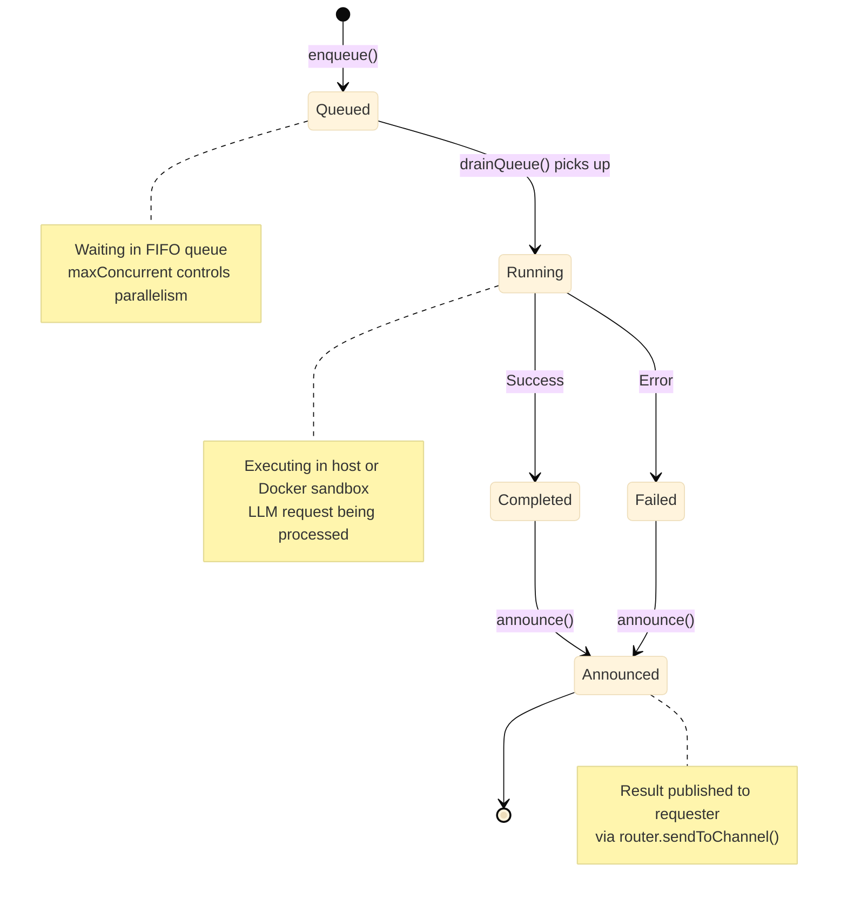
```mermaid
%%{init: {'theme': 'base'}}%%

stateDiagram-v2
    [*] --> Queued: enqueue()

    Queued --> Running: drainQueue() picks up

    Running --> Completed: Success
    Running --> Failed: Error

    Completed --> Announced: announce()
    Failed --> Announced: announce()

    Announced --> [*]

    note right of Queued
        Waiting in FIFO queue
        maxConcurrent controls parallelism
    end note

    note right of Running
        Executing in host or Docker sandbox
        LLM request being processed
    end note

    note right of Announced
        Result published to requester
        via router.sendToChannel()
    end note
```

---

## State Layer

Policy-gated, audit-hooked access to identity, memory, user profiles, and session state stores.

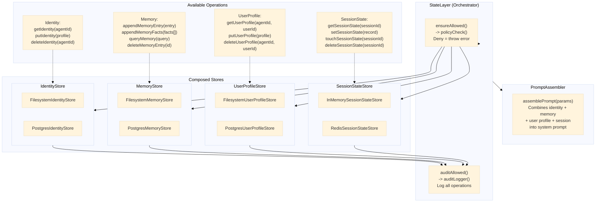
```mermaid
%%{init: {'theme': 'base'}}%%

flowchart TB
    subgraph SL["StateLayer (Orchestrator)"]
        PolicyGate["ensureAllowed()<br/>-> policyCheck()<br/>Deny = throw error"]
        AuditHook["auditAllowed()<br/>-> auditLogger()<br/>Log all operations"]
    end

    subgraph Stores["Composed Stores"]
        subgraph Identity["IdentityStore"]
            IdFS["FilesystemIdentityStore"]
            IdPG["PostgresIdentityStore"]
        end

        subgraph Memory["MemoryStore"]
            MemFS["FilesystemMemoryStore"]
            MemPG["PostgresMemoryStore"]
        end

        subgraph UserProfile["UserProfileStore"]
            UPFS["FilesystemUserProfileStore"]
            UPPG["PostgresUserProfileStore"]
        end

        subgraph SessionState["SessionStateStore"]
            SSIM["InMemorySessionStateStore"]
            SSRedis["RedisSessionStateStore"]
        end
    end

    subgraph Prompt["PromptAssembler"]
        Assemble["assemblePrompt(params)<br/>Combines identity + memory<br/>+ user profile + session<br/>into system prompt"]
    end

    subgraph Operations["Available Operations"]
        IdOps["Identity:<br/>getIdentity(agentId)<br/>putIdentity(profile)<br/>deleteIdentity(agentId)"]
        MemOps["Memory:<br/>appendMemoryEntry(entry)<br/>appendMemoryFacts(facts[])<br/>queryMemory(query)<br/>deleteMemoryEntry(id)"]
        UPOps["UserProfile:<br/>getUserProfile(agentId, userId)<br/>putUserProfile(profile)<br/>deleteUserProfile(agentId, userId)"]
        SSOps["SessionState:<br/>getSessionState(sessionId)<br/>setSessionState(record)<br/>touchSessionState(sessionId)<br/>deleteSessionState(sessionId)"]
    end

    SL --> PolicyGate
    PolicyGate --> Identity & Memory & UserProfile & SessionState
    Identity & Memory & UserProfile & SessionState --> AuditHook
    SL --> Prompt

    IdOps -.-> Identity
    MemOps -.-> Memory
    UPOps -.-> UserProfile
    SSOps -.-> SessionState
```

### Session Storage (ER Diagram)

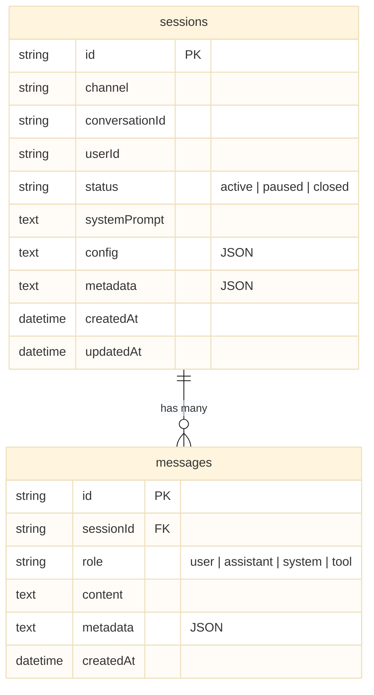
```mermaid
%%{init: {'theme': 'base'}}%%

erDiagram
    sessions {
        string id PK
        string channel
        string conversationId
        string userId
        string status "active | paused | closed"
        text systemPrompt
        text config "JSON"
        text metadata "JSON"
        datetime createdAt
        datetime updatedAt
    }

    messages {
        string id PK
        string sessionId FK
        string role "user | assistant | system | tool"
        text content
        text metadata "JSON"
        datetime createdAt
    }

    sessions ||--o{ messages : "has many"
```

---

## NATS Message Bus

Client API, full topic namespace, and bus implementations.

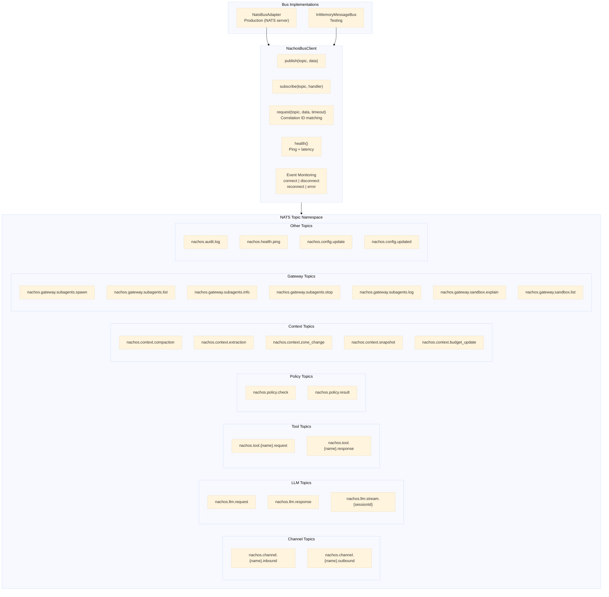
```mermaid
%%{init: {'theme': 'base'}}%%

flowchart TB
    subgraph BusClient["NachosBusClient"]
        Pub["publish(topic, data)"]
        Sub["subscribe(topic, handler)"]
        ReqRep["request(topic, data, timeout)<br/>Correlation ID matching"]
        Health["health()<br/>Ping + latency"]
        Events["Event Monitoring<br/>connect | disconnect<br/>reconnect | error"]
    end

    subgraph Topics["NATS Topic Namespace"]
        subgraph ChTopics["Channel Topics"]
            ChIn["nachos.channel.{name}.inbound"]
            ChOut["nachos.channel.{name}.outbound"]
        end

        subgraph LLMTopics["LLM Topics"]
            LLMReq["nachos.llm.request"]
            LLMRes["nachos.llm.response"]
            LLMStream["nachos.llm.stream.{sessionId}"]
        end

        subgraph ToolTopics["Tool Topics"]
            ToolReq["nachos.tool.{name}.request"]
            ToolRes["nachos.tool.{name}.response"]
        end

        subgraph PolicyTopics["Policy Topics"]
            PolCheck["nachos.policy.check"]
            PolResult["nachos.policy.result"]
        end

        subgraph ContextTopics["Context Topics"]
            CtxCompact["nachos.context.compaction"]
            CtxExtract["nachos.context.extraction"]
            CtxZone["nachos.context.zone_change"]
            CtxSnap["nachos.context.snapshot"]
            CtxBudget["nachos.context.budget_update"]
        end

        subgraph GwTopics["Gateway Topics"]
            SaSpawn["nachos.gateway.subagents.spawn"]
            SaList["nachos.gateway.subagents.list"]
            SaInfo["nachos.gateway.subagents.info"]
            SaStop["nachos.gateway.subagents.stop"]
            SaLog["nachos.gateway.subagents.log"]
            SbExplain["nachos.gateway.sandbox.explain"]
            SbList["nachos.gateway.sandbox.list"]
        end

        subgraph OtherTopics["Other Topics"]
            AuditLog["nachos.audit.log"]
            HealthPing["nachos.health.ping"]
            ConfigUp["nachos.config.update"]
            ConfigDone["nachos.config.updated"]
        end
    end

    subgraph Impls["Bus Implementations"]
        NATS["NatsBusAdapter<br/>Production (NATS server)"]
        InMem["InMemoryMessageBus<br/>Testing"]
    end

    BusClient --> Topics
    NATS --> BusClient
    InMem --> BusClient
```

### Message Envelope

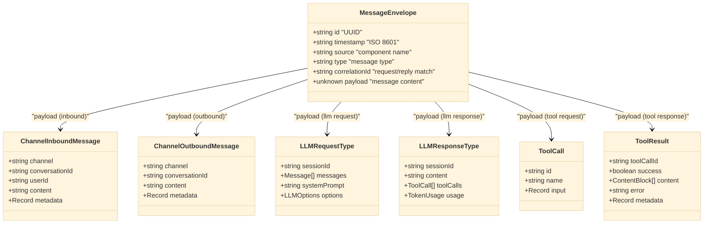
```mermaid
%%{init: {'theme': 'base'}}%%

classDiagram
    class MessageEnvelope {
        +string id  "UUID"
        +string timestamp  "ISO 8601"
        +string source  "component name"
        +string type  "message type"
        +string correlationId  "request/reply match"
        +unknown payload  "message content"
    }

    class ChannelInboundMessage {
        +string channel
        +string conversationId
        +string userId
        +string content
        +Record metadata
    }

    class ChannelOutboundMessage {
        +string channel
        +string conversationId
        +string content
        +Record metadata
    }

    class LLMRequestType {
        +string sessionId
        +Message[] messages
        +string systemPrompt
        +LLMOptions options
    }

    class LLMResponseType {
        +string sessionId
        +string content
        +ToolCall[] toolCalls
        +TokenUsage usage
    }

    class ToolCall {
        +string id
        +string name
        +Record input
    }

    class ToolResult {
        +string toolCallId
        +boolean success
        +ContentBlock[] content
        +string error
        +Record metadata
    }

    MessageEnvelope --> ChannelInboundMessage : "payload (inbound)"
    MessageEnvelope --> ChannelOutboundMessage : "payload (outbound)"
    MessageEnvelope --> LLMRequestType : "payload (llm request)"
    MessageEnvelope --> LLMResponseType : "payload (llm response)"
    MessageEnvelope --> ToolCall : "payload (tool request)"
    MessageEnvelope --> ToolResult : "payload (tool response)"
```

---

## LLM Proxy

Provider selection, retry with backoff, cooldown management, failover chain, and streaming.

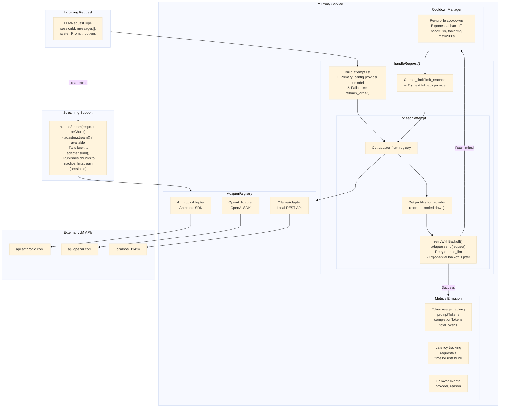
```mermaid
%%{init: {'theme': 'base'}}%%

flowchart TB
    subgraph Input["Incoming Request"]
        LLMReq["LLMRequestType<br/>sessionId, messages[],<br/>systemPrompt, options"]
    end

    subgraph Proxy["LLM Proxy Service"]
        subgraph Handler["handleRequest()"]
            BuildAttempts["Build attempt list<br/>1. Primary: config provider + model<br/>2. Fallbacks: fallback_order[]"]

            subgraph AttemptLoop["For each attempt"]
                GetAdapter["Get adapter from registry"]
                GetProfiles["Get profiles for provider<br/>(exclude cooled-down)"]
                Retry["retryWithBackoff()<br/>adapter.send(request)<br/>- Retry on rate_limit<br/>- Exponential backoff + jitter"]
            end

            Failover["On rate_limit/limit_reached:<br/>-> Try next fallback provider"]
        end

        subgraph Registry["AdapterRegistry"]
            AnthropicA["AnthropicAdapter<br/>Anthropic SDK"]
            OpenAIA["OpenAIAdapter<br/>OpenAI SDK"]
            OllamaAdpt["OllamaAdapter<br/>Local REST API"]
        end

        subgraph Cooldowns["CooldownManager"]
            ProfileCD["Per-profile cooldowns<br/>Exponential backoff:<br/>base=60s, factor=2, max=900s"]
        end

        subgraph Metrics["Metrics Emission"]
            Usage["Token usage tracking<br/>promptTokens<br/>completionTokens<br/>totalTokens"]
            Latency["Latency tracking<br/>requestMs<br/>timeToFirstChunk"]
            FailoverEvt["Failover events<br/>provider, reason"]
        end
    end

    subgraph Streaming["Streaming Support"]
        StreamHandler["handleStream(request, onChunk)<br/>- adapter.stream() if available<br/>- Falls back to adapter.send()<br/>- Publishes chunks to<br/>  nachos.llm.stream.{sessionId}"]
    end

    subgraph Providers["External LLM APIs"]
        AnthropicAPI["api.anthropic.com"]
        OpenAIAPI["api.openai.com"]
        OllamaAPI["localhost:11434"]
    end

    Input --> BuildAttempts
    BuildAttempts --> GetAdapter --> GetProfiles --> Retry
    Retry -->|Rate limited| Cooldowns
    Cooldowns --> Failover --> GetAdapter
    Retry -->|Success| Metrics

    GetAdapter --> Registry
    AnthropicA --> AnthropicAPI
    OpenAIA --> OpenAIAPI
    OllamaAdpt --> OllamaAPI

    Input -->|stream=true| StreamHandler
    StreamHandler --> Registry
```

### Provider Failover Sequence

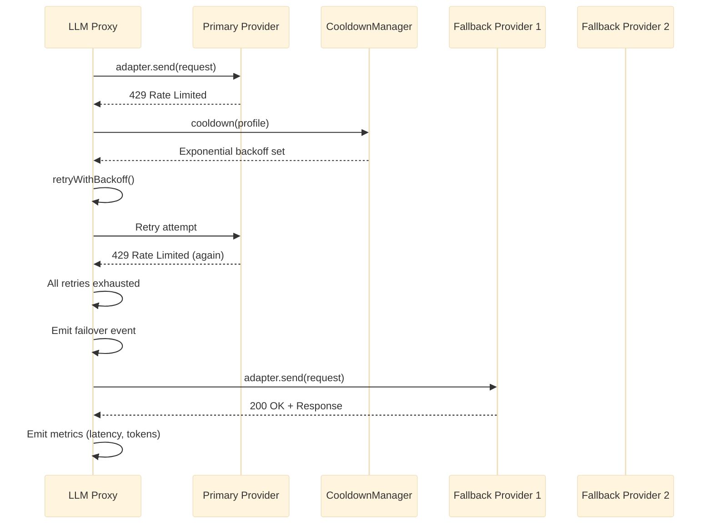
```mermaid
%%{init: {'theme': 'base'}}%%

sequenceDiagram
    participant R as LLM Proxy
    participant P1 as Primary Provider
    participant CD as CooldownManager
    participant P2 as Fallback Provider 1
    participant P3 as Fallback Provider 2

    R->>P1: adapter.send(request)
    P1-->>R: 429 Rate Limited

    R->>CD: cooldown(profile)
    CD-->>R: Exponential backoff set

    R->>R: retryWithBackoff()
    R->>P1: Retry attempt
    P1-->>R: 429 Rate Limited (again)

    R->>R: All retries exhausted
    R->>R: Emit failover event

    R->>P2: adapter.send(request)
    P2-->>R: 200 OK + Response

    R->>R: Emit metrics (latency, tokens)
```

---

## Channels Architecture

Base adapter, platform-specific implementations, and bus integration.

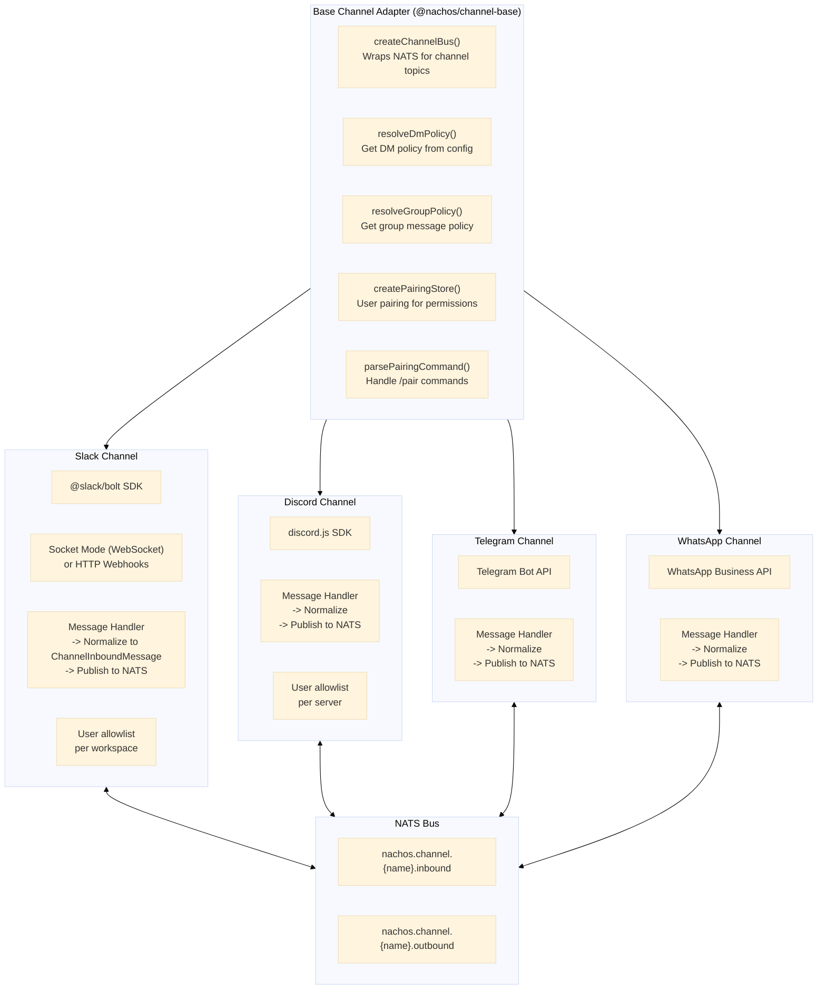
```mermaid
%%{init: {'theme': 'base'}}%%

flowchart TB
    subgraph Base["Base Channel Adapter (@nachos/channel-base)"]
        Factory["createChannelBus()<br/>Wraps NATS for channel topics"]
        DmPolicy["resolveDmPolicy()<br/>Get DM policy from config"]
        GroupPolicy["resolveGroupPolicy()<br/>Get group message policy"]
        PairingStore["createPairingStore()<br/>User pairing for permissions"]
        PairCmd["parsePairingCommand()<br/>Handle /pair commands"]
    end

    subgraph SlackCh["Slack Channel"]
        SlackSDK["@slack/bolt SDK"]
        SocketMode["Socket Mode (WebSocket)<br/>or HTTP Webhooks"]
        SlackHandler["Message Handler<br/>-> Normalize to ChannelInboundMessage<br/>-> Publish to NATS"]
        SlackAllow["User allowlist<br/>per workspace"]
    end

    subgraph DiscordCh["Discord Channel"]
        DiscordSDK["discord.js SDK"]
        DiscordHandler["Message Handler<br/>-> Normalize<br/>-> Publish to NATS"]
        DiscordAllow["User allowlist<br/>per server"]
    end

    subgraph TelegramCh["Telegram Channel"]
        TelegramSDK["Telegram Bot API"]
        TelegramHandler["Message Handler<br/>-> Normalize<br/>-> Publish to NATS"]
    end

    subgraph WhatsAppCh["WhatsApp Channel"]
        WhatsAppSDK["WhatsApp Business API"]
        WhatsAppHandler["Message Handler<br/>-> Normalize<br/>-> Publish to NATS"]
    end

    Base --> SlackCh & DiscordCh & TelegramCh & WhatsAppCh

    subgraph BusCh["NATS Bus"]
        Inbound["nachos.channel.{name}.inbound"]
        Outbound["nachos.channel.{name}.outbound"]
    end

    SlackCh <--> BusCh
    DiscordCh <--> BusCh
    TelegramCh <--> BusCh
    WhatsAppCh <--> BusCh
```

---

## Skills System

SKILL.md loading, prompt injection, exec flow, and tool group policy gating.

```mermaid
%%{init: {'theme': 'base'}}%%

flowchart TB
    subgraph SkillFiles["SKILL.md Files (skills/)"]
        GP["goplaces/SKILL.md<br/>----------<br/>name: goplaces<br/>group: lookup<br/>bins: [goplaces]<br/>env: [GOOGLE_PLACES_API_KEY]"]
        GG["gifgrep/SKILL.md<br/>----------<br/>name: gifgrep<br/>group: media<br/>bins: [gifgrep]"]
        SM["summarize/SKILL.md<br/>----------<br/>name: summarize<br/>group: summarize<br/>bins: [summarize]"]
        G["gog/SKILL.md<br/>----------<br/>name: gog<br/>group: workspace<br/>bins: [gog]"]
    end

    subgraph Loader["SkillLoader"]
        Parse["Parse YAML frontmatter<br/>+ markdown body"]
        Filter["Filter by tool groups<br/>(policy-controlled)"]
        Inject["Inject into LLM<br/>system prompt"]
    end

    subgraph Execution["Execution Flow"]
        LLM["LLM reads SKILL.md<br/>in system prompt"]
        Call["LLM calls exec()<br/>{command: 'goplaces search coffee'}"]
        TC["ToolCoordinator<br/>evaluates policy"]
        LTH["LocalToolHandler<br/>routes to ShellTool"]
        STExec["ShellTool<br/>spawns subprocess"]
        ResultExec["Output returned<br/>to LLM context"]
    end

    subgraph Groups["Tool Groups (Policy)"]
        Lookup["lookup<br/>goplaces"]
        Media["media<br/>gifgrep"]
        SumGroup["summarize<br/>summarize"]
        Workspace["workspace<br/>gog"]
    end

    SkillFiles --> Parse --> Filter --> Inject
    LLM --> Call --> TC --> LTH --> STExec
    STExec --> ResultExec --> LLM

    Groups -.->|Policy gating| TC
```

---

## Audit System

Event sources, composite provider fan-out, and audit event schema.

```mermaid
%%{init: {'theme': 'base'}}%%

flowchart TB
    subgraph Sources["Audit Event Sources"]
        GatewayA["Gateway<br/>Session events"]
        CheeseA["Cheese<br/>Policy decisions"]
        ToolsA["ToolCoordinator<br/>Tool executions"]
        StateLA["StateLayer<br/>State operations"]
        RouterA["Router<br/>Message routing"]
    end

    subgraph Logger["AuditLogger"]
        Emit["emit(event)<br/>Normalize + timestamp"]
    end

    subgraph ProvidersA["Audit Providers"]
        Composite["CompositeAuditProvider<br/>Fans out to multiple"]
        FileP["FileAuditProvider<br/>JSON lines to file"]
        SQLiteP["SQLiteAuditProvider<br/>Structured storage"]
        WebhookP["WebhookAuditProvider<br/>HTTP POST delivery"]
    end

    subgraph Event["AuditEvent"]
        Fields["eventId: UUID<br/>timestamp: ISO<br/>eventType: string<br/>outcome: allow|deny|error<br/>userId: string<br/>sessionId: string<br/>resource: {type, id}<br/>action: string<br/>metadata: Record<br/>durationMs: number"]
    end

    Sources --> Logger
    Logger --> Composite
    Composite --> FileP & SQLiteP & WebhookP
    Logger -.-> Event
```

---

## Container Architecture

All containers with their base images, resource limits, and network assignments.

```mermaid
%%{init: {'theme': 'base'}}%%

flowchart TB
    subgraph Compose["Docker Compose"]
        subgraph Internal["nachos-internal (isolated, no external access)"]
            gateway["gateway<br/>--------<br/>node:22-alpine<br/>non-root, read-only FS<br/>512MB<br/>--------<br/>Router, Cheese,<br/>ToolCoord, SubagentOrch,<br/>ContextMgr, StateLayer,<br/>Audit, DLP, ShellTool"]
            bus["bus<br/>--------<br/>nats:alpine<br/>non-root<br/>256MB<br/>--------<br/>NATS Server<br/>Ports: 4222, 8222"]
            filesystem["filesystem<br/>--------<br/>node:22-alpine<br/>non-root<br/>128MB<br/>--------<br/>File read/write"]
            coderunner["code-runner<br/>--------<br/>node:22-alpine<br/>sandboxed<br/>512MB<br/>--------<br/>JS/Python execution"]
        end

        subgraph EgressNet["nachos-egress (controlled external access)"]
            llmproxy["llm-proxy<br/>--------<br/>node:22-alpine<br/>-> LLM APIs only<br/>256MB<br/>--------<br/>Anthropic, OpenAI, Ollama"]
            webchat["webchat<br/>--------<br/>node:22-alpine<br/>-> port 8080<br/>256MB"]
            slack["slack<br/>--------<br/>node:22-alpine<br/>-> slack.com<br/>256MB"]
            discord["discord<br/>--------<br/>node:22-alpine<br/>-> discord.com<br/>256MB"]
            telegram["telegram<br/>--------<br/>node:22-alpine<br/>-> api.telegram.org<br/>256MB"]
            browser["browser<br/>--------<br/>playwright<br/>-> configured domains<br/>1GB"]
            webfetch["web-fetch<br/>--------<br/>node:22-alpine<br/>-> allowed URLs<br/>256MB<br/>SSRF protection"]
        end
    end

    subgraph Volumes["Volumes"]
        natsdata["nats-data"]
        sessionsdb["sessions.db"]
        policies["./policies"]
        workspace["./workspace"]
    end

    bus --- natsdata
    gateway --- sessionsdb
    gateway --- policies
    filesystem --- workspace

    Internal <-->|NATS| EgressNet
```

---

## Network Topology

External services, egress network, internal network, and host volume mounts.

```mermaid
%%{init: {'theme': 'base'}}%%

flowchart TB
    subgraph Internet["Internet"]
        anthropic["api.anthropic.com"]
        openai["api.openai.com"]
        slackapi["api.slack.com"]
        discordapi["discord.com/api"]
        telegramapi["api.telegram.org"]
        websites["Allowed websites"]
        googleapi["Google APIs"]
    end

    subgraph EgressNetDiag["nachos-egress (controlled external)"]
        llm["LLM Proxy<br/>-> anthropic, openai"]
        slackC["Slack<br/>-> slack.com"]
        discordC["Discord<br/>-> discord.com"]
        telegramC["Telegram<br/>-> telegram.org"]
        browserC["Browser<br/>-> configured domains"]
        webfetchC["Web Fetch<br/>-> allowed URLs"]
    end

    subgraph InternalNet["nachos-internal (no external access)"]
        gatewayN["Gateway"]
        busN["NATS Bus"]
        fs["Filesystem"]
        code["Code Runner"]
    end

    subgraph Host["Host Machine"]
        workspaceV["./workspace"]
        stateV["./state"]
        policiesV["./policies"]
    end

    llm <--> anthropic & openai
    slackC <--> slackapi
    discordC <--> discordapi
    telegramC <--> telegramapi
    browserC <--> websites
    webfetchC <--> websites
    gatewayN <-.-> googleapi

    EgressNetDiag <-->|NATS| InternalNet

    fs --- workspaceV
    gatewayN --- stateV & policiesV
```

---

## Configuration Flow

TOML loading, schema validation, env interpolation, hot-reload, and Docker Compose generation.

```mermaid
%%{init: {'theme': 'base'}}%%

flowchart LR
    subgraph Sources["Configuration Sources"]
        TOML["nachos.toml<br/>(primary config)"]
        ENV[".env file<br/>+ shell env vars"]
        CLI["CLI flags<br/>(overrides)"]
    end

    subgraph Loader["@nachos/config"]
        LoadTOML["loader.ts<br/>Parse TOML from disk"]
        Schema["schema.ts<br/>NachosConfig schema"]
        Validate["validation.ts<br/>Validate against schema"]
        EnvOverlay["env.ts<br/>Environment variable<br/>interpolation"]
        RuntimeOL["runtime-overlay.ts<br/>Runtime state persistence"]
        Merge["Merge all sources<br/>CLI > ENV > TOML"]
    end

    subgraph HotReload["Hot Reload"]
        Watch["hotreload.ts<br/>File watcher"]
        RegistryHR["registry.ts<br/>Notify subscribers"]
        Publish["Bus: nachos.config.updated"]
    end

    subgraph Output["Validated Config"]
        NachosConfig["NachosConfig<br/>- nachos (name, version)<br/>- llm (provider, model, profiles)<br/>- channels (slack, discord, etc.)<br/>- security (mode, audit)<br/>- tools (browser, filesystem, etc.)<br/>- context (sliding_window, etc.)"]
    end

    subgraph Generated["Generated Artifacts"]
        ComposeOut["docker-compose.yml"]
        Networks["Network definitions"]
        VolumeDefs["Volume mounts"]
        SecretInject["Secret injection"]
    end

    TOML --> LoadTOML --> Validate
    Schema --> Validate
    ENV --> EnvOverlay
    CLI --> Merge
    Validate --> EnvOverlay --> Merge --> RuntimeOL --> NachosConfig

    NachosConfig --> ComposeOut & Networks & VolumeDefs & SecretInject

    TOML -->|File change| Watch --> RegistryHR --> Publish
```

---

## Security Gate Sequence

Every request passes through 8 security checkpoints in order.

```mermaid
%%{init: {'theme': 'base'}}%%

flowchart TD
    Req["Incoming Request"] --> RL

    subgraph Gates["Security Gates (in order)"]
        RL["1. Rate Limiter<br/>Token bucket per user/action"]
        Policy["2. Cheese Policy Check<br/>resource + action + conditions"]
        DLPScan["3. DLP Scanner<br/>Sensitive data detection"]
        ToolPolicy["4. Tool Policy Check<br/>Tool-specific rules"]
        Approval["5. Approval Manager<br/>(RESTRICTED tier only)"]
        Cache["6. Tool Cache<br/>Skip if cached"]
        StatePolicy["7. State Layer Policy<br/>Access control on state ops"]
        Audit["8. Audit Logger<br/>Record all events"]
    end

    RL -->|Under limit| Policy
    RL -->|Over limit| Throttled["Throttled"]

    Policy -->|Allowed| DLPScan
    Policy -->|Denied| Denied1["Denied"]

    DLPScan -->|Clean| ToolPolicy
    DLPScan -->|Sensitive| Blocked["Blocked + Redacted"]

    ToolPolicy -->|Allowed| Approval
    ToolPolicy -->|Denied| Denied2["Denied"]

    Approval -->|Approved| Cache
    Approval -->|Denied| Denied3["Denied"]

    Cache -->|Hit| CacheResult["Cached Result"]
    Cache -->|Miss| ExecuteGate["Execute"]

    ExecuteGate --> StatePolicy
    StatePolicy -->|Allowed| Audit
    StatePolicy -->|Denied| Denied4["Denied"]

    Audit --> Done["Complete"]

    Throttled & Denied1 & Denied2 & Denied3 & Blocked & Denied4 --> Audit
```

---

## Session Lifecycle

Full state machine including the active sub-states (processing, waiting for LLM, executing tools).

```mermaid
%%{init: {'theme': 'base'}}%%

stateDiagram-v2
    [*] --> Created: getOrCreateSession()

    Created --> Active: First message

    Active --> Active: Message exchange
    Active --> Active: Tool execution
    Active --> Active: Context compaction
    Active --> Paused: User timeout

    Active --> Ended: /end command
    Active --> Ended: Session expired

    Paused --> Active: New message
    Paused --> Ended: Extended timeout

    Ended --> [*]

    state Active {
        [*] --> Processing
        Processing --> WaitingForLLM: sendLLMRequest()
        WaitingForLLM --> Processing: LLM response
        WaitingForLLM --> ExecutingTools: tool_calls in response
        ExecutingTools --> WaitingForLLM: Tool results follow-up LLM
        Processing --> [*]: Send response to channel
    }

    note right of Active
        Messages stored in SQLite
        Context budget tracked
        Tools available per policy
        State layer accessible
    end note

    note right of Paused
        State preserved in DB
        No active processing
        Can resume seamlessly
    end note
```

---

## Monorepo Package Graph

All `@nachos/*` packages and their dependency relationships.

```mermaid
%%{init: {'theme': 'base'}}%%

flowchart BT
    subgraph Shared["Shared Packages"]
        Types["@nachos/types<br/>Schemas, interfaces,<br/>error definitions"]
        Utils["@nachos/utils<br/>Utility functions"]
        ConfigPkg["@nachos/config<br/>TOML loading,<br/>validation, hot-reload"]
        CtxMgrPkg["@nachos/context-manager<br/>Budget, sliding window,<br/>extraction, summarization"]
        ToolBasePkg["@nachos/tool-base<br/>Tool interface<br/>abstractions"]
    end

    subgraph Core["Core Packages"]
        BusPkg["@nachos/bus<br/>NATS client wrapper"]
        GatewayPkg["@nachos/gateway<br/>Router, Sessions, Cheese,<br/>Tools, Subagents, State"]
        LLMProxyPkg["@nachos/llm-proxy<br/>Provider adapters,<br/>retry, cooldowns"]
    end

    subgraph ChannelsPkg["Channel Packages"]
        ChBase["@nachos/channel-base<br/>Policy, pairing, factory"]
        ChSlack["@nachos/channel-slack"]
        ChDiscord["@nachos/channel-discord"]
        ChTelegram["@nachos/channel-telegram"]
        ChWhatsApp["@nachos/channel-whatsapp"]
    end

    subgraph ToolsPkg["Tool Packages"]
        TBrowser["@nachos/tool-browser"]
        TFS["@nachos/tool-filesystem"]
        TCode["@nachos/tool-code-runner"]
        TFetch["@nachos/tool-web-fetch"]
        TCopilot["@nachos/tool-copilot"]
        TMCP["@nachos/tool-claude-code-mcp"]
    end

    subgraph CLIPkg["CLI"]
        NachosCLI["@nachos/cli<br/>Commander.js"]
    end

    Types --> Utils
    Types --> ConfigPkg
    Types --> CtxMgrPkg
    Types --> ToolBasePkg
    Types --> BusPkg

    BusPkg --> GatewayPkg
    ConfigPkg --> GatewayPkg
    CtxMgrPkg --> GatewayPkg
    ToolBasePkg --> GatewayPkg

    BusPkg --> LLMProxyPkg

    ChBase --> ChSlack & ChDiscord & ChTelegram & ChWhatsApp
    BusPkg --> ChBase

    ToolBasePkg --> TBrowser & TFS & TCode & TFetch & TCopilot & TMCP
    BusPkg --> TBrowser & TFS & TCode & TFetch & TCopilot & TMCP

    ConfigPkg --> NachosCLI
    Types --> NachosCLI
```

---

## CLI Command Tree

Full command hierarchy including subagent and memory management.

```mermaid
%%{init: {'theme': 'base'}}%%

flowchart TD
    nachos["nachos"]

    nachos --> init["init<br/>Initialize config"]
    nachos --> up["up [services...]<br/>Start stack"]
    nachos --> down["down<br/>Stop stack"]
    nachos --> restart["restart [service]<br/>Restart service"]
    nachos --> logs["logs [service]<br/>Aggregated logs"]
    nachos --> status["status<br/>Service health"]

    nachos --> add["add"]
    add --> add_channel["channel name"]
    add --> add_tool["tool name"]

    nachos --> remove["remove"]
    remove --> rm_channel["channel name"]
    remove --> rm_tool["tool name"]

    nachos --> list["list [type]"]
    nachos --> search["search type"]

    nachos --> config["config"]
    config --> config_edit["edit"]
    config --> config_validate["validate"]
    config --> config_show["show"]

    nachos --> policy["policy"]
    policy --> policy_validate["validate"]

    nachos --> doctor["doctor<br/>Diagnostics"]
    nachos --> version["version"]

    nachos --> create["create"]
    create --> create_channel["channel name"]
    create --> create_tool["tool name"]

    nachos --> chat["chat<br/>Interactive"]

    nachos --> subagents["subagents"]
    subagents --> sa_list["list"]
    subagents --> sa_info["info runId"]
    subagents --> sa_stop["stop runId"]

    nachos --> memory["memory"]
    memory --> mem_list["list"]
    memory --> mem_query["query"]
```
