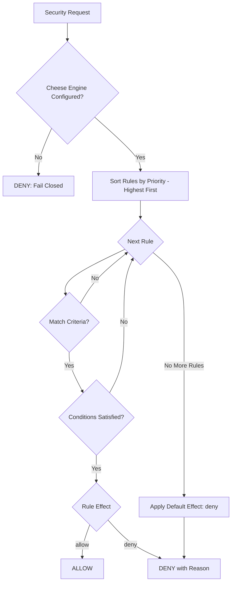

# Policies

The Cheese policy engine runs inside the gateway process and evaluates every action against loaded YAML rules. It provides sub-millisecond evaluation with hot-reload support and a deny-by-default posture.

## How policies work



If no policy rule matches, the default effect is `deny`. If the Cheese engine is not configured (null/undefined), all tool calls are blocked (fail-closed).

## Policy file structure

Policy files are YAML documents in the `policies/` directory:

```
policies/
  strict.yaml      -- Rules active when mode = "strict"
  standard.yaml    -- Rules active when mode = "standard"
  permissive.yaml  -- Rules active when mode = "permissive"
```

The loader filters documents by `metadata.mode`, loading only rules that match the current security mode.

### Example policy document

```yaml
version: "1.0"
metadata:
  name: "Standard Mode Security Policies"
  description: "Balanced security for typical use cases"
  mode: "standard"

rules:
  - id: "standard-llm-allow"
    description: "Allow LLM calls"
    priority: 1000
    match:
      resource: "llm"
      action: "call"
    effect: "allow"

  - id: "standard-tool-filesystem-read"
    description: "Allow filesystem read in workspace"
    priority: 750
    match:
      resource: "tool"
      resourceId: "filesystem_read"
    conditions:
      - field: "metadata.path"
        operator: "starts_with"
        value: "/workspace"
    effect: "allow"

  - id: "standard-tool-filesystem-read-deny-outside"
    description: "Deny filesystem read outside workspace"
    priority: 749
    match:
      resource: "tool"
      resourceId: "filesystem_read"
    effect: "deny"
    reason: "Filesystem read is restricted to /workspace directory"
```

## Rule structure

| Field | Type | Required | Description |
|-------|------|----------|-------------|
| `id` | string | Yes | Unique rule identifier |
| `description` | string | No | Human-readable description |
| `priority` | number | Yes | Evaluation order (higher = first) |
| `match` | object | Yes | Resource, action, and resourceId criteria |
| `conditions` | array | No | Additional conditions (AND logic) |
| `effect` | `"allow"` or `"deny"` | Yes | Outcome when rule matches |
| `reason` | string | No | Denial reason message |

### Match criteria

- `resource`: `tool`, `channel`, `dm`, `filesystem`, `network`, `llm`
- `action`: `read`, `write`, `execute`, `send`, `receive`, `call`
- `resourceId`: Specific tool name, channel ID, etc.

### Condition operators

| Operator | Description |
|----------|-------------|
| `equals` | Exact match |
| `not_equals` | Negated match |
| `in` | Value in array |
| `not_in` | Value not in array |
| `contains` | Substring match |
| `matches` | Regex match (with ReDoS protection) |
| `starts_with` | Prefix match |
| `ends_with` | Suffix match |

## Priority ranges

| Priority Range | Category |
|---------------|----------|
| 1000 | LLM access |
| 900-901 | DM access control |
| 850 | Channel messages |
| 820-825 | Tool groups and web fetch domain allowlists |
| 790-800 | Standard-tier tools (browser, GitHub, Bitbucket, web search) |
| 750-760 | Filesystem read access |
| 720-749 | Filesystem write/edit/patch access |
| 690-700 | Code runners (Python, JavaScript) |
| 670-680 | Copilot, Composio |
| 655-660 | Shell tool, Agent exec |
| 599-600 | Network access |

## Security tiers

Every tool is assigned a security tier controlling policy enforcement:

| Tier | Name | Tools | Approval Required |
|------|------|-------|-------------------|
| SAFE (0) | Safe | `filesystem_read`, any tool with `read`/`list`/`get` in name | No |
| STANDARD (1) | Standard | `browser`, `code_runner_*`, `web_search`, `web_fetch` | No |
| ELEVATED (2) | Elevated | `filesystem_write/edit/patch`, `agent_exec`, `composio` | No |
| RESTRICTED (3) | Restricted | `copilot` | Yes |

## ReDoS protection

The `matches` operator includes two safeguards:

1. **Pattern length limit**: Patterns exceeding 200 characters are rejected
2. **Nested quantifier detection**: Patterns like `(a+)+` or `(a*)+` are rejected

## Hot-reload

Policy files are watched for changes using `fs.watch()` with 100ms debouncing. On change:

- New rules are validated
- If validation passes, the rule set is swapped atomically
- If validation fails, the previous rules are retained (no partial updates)

No restart is required for policy changes.

## Validating policies

```bash
nachos policy validate
```

The validator checks:
- Required fields: `version`, `rules` array
- Each rule has `id`, `priority`, `match`, `effect`
- No duplicate rule IDs within a document
- Valid resource types, action types, and condition operators

## Tool-specific policies

### GitHub and Bitbucket

```toml
[tools.github]
repo_allowlist = ["myorg/backend", "myorg/frontend"]

[tools.bitbucket]
workspace_allowlist = ["myworkspace"]
```

### Web Fetch domain restrictions

```toml
[tools.web_fetch]
domain_allowlist = ["docs.nachos.dev", "github.com", "*.wikipedia.org"]
```

### Composio app restrictions

```toml
[tools.composio]
allowed_apps = ["gmail", "googlecalendar"]
```

### Cron ownership

Cron jobs are user-scoped: users can only manage their own jobs. System jobs (heartbeat) are protected from user modification.
